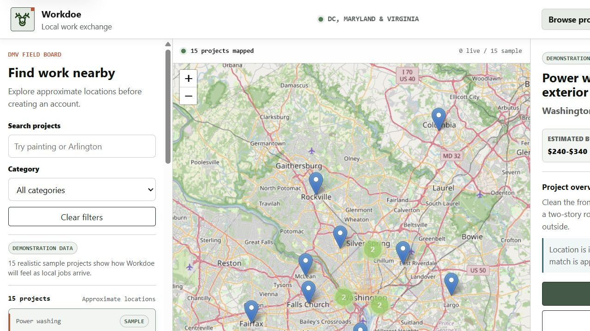
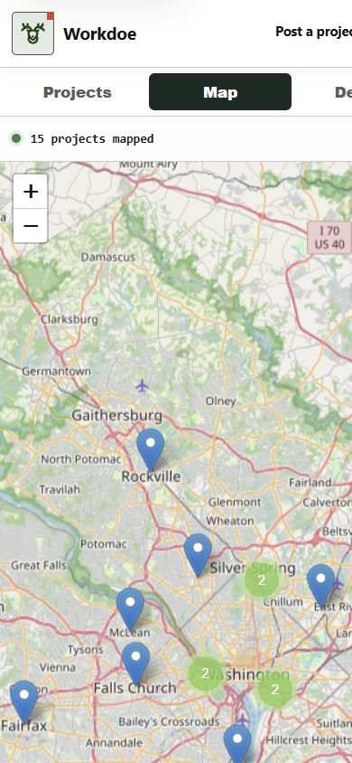
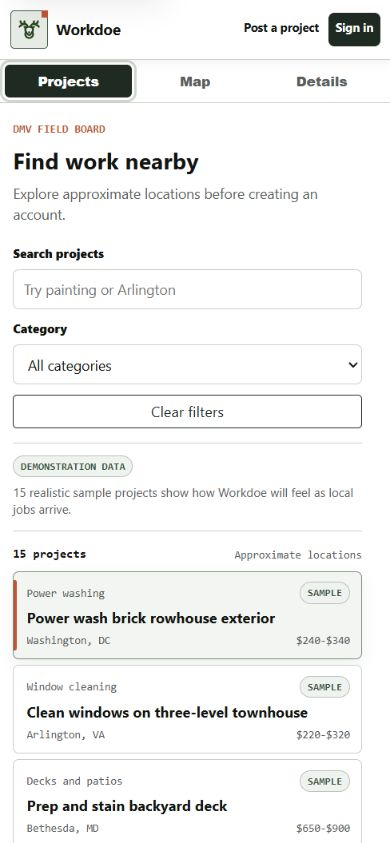
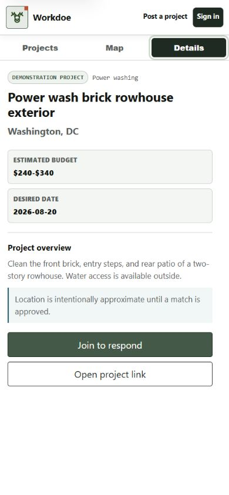
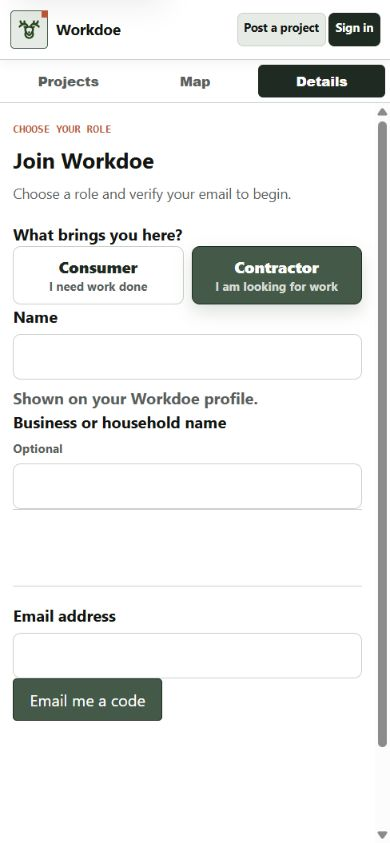
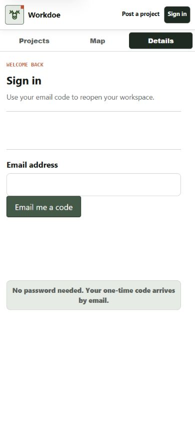

# Workdoe Launch Readiness Review

Review date: 2026-08-15 EDT

Production reviewed: https://workdoe.com

## Decision

**No-go for unrestricted public account creation.**

The public browse experience is clean, responsive, HTTPS-only, and privacy
aware. The repository has strong automated coverage and a credible Cloudflare
security baseline. However, production login currently uses a Clerk development
instance, the controlled-beta Clerk settings are not proven, the required
public policy/operating decisions are incomplete, and a real two-role
OTP-to-match journey has not been proven. Those are launch blockers, not
optional polish.

A limited read-only demonstration is acceptable because all visible projects
are accurately labeled as sample data. A supervised beta becomes reasonable
after the Clerk production migration, real two-user end-to-end test, monitored
admin/support path, and beta policies are complete.

## Evidence and method

- Reviewed repository requirements, prior UX/provenance notes, Cloudflare
  migration/auth documentation, D1/R2/Worker code, public templates and assets,
  deployment scripts, dependency metadata, and tests.
- Exercised the live public map, filters, project list, project detail, start,
  role switch, and sign-in at desktop and mobile viewports in the selected
  in-app browser.
- Ran unit, dependency, static-security, Cloudflare preflight, deployment
  dry-run, HTTP header, negative authorization, and production smoke checks.
- Cross-referenced current Cloudflare, Clerk, OWASP ASVS, WCAG 2.2, FTC data
  security, GitHub licensing, and OpenStreetMap tile-policy documentation.

Screenshots are visual evidence only. They do not establish screen-reader,
keyboard, contrast, legal, or security compliance by themselves.

## Public flow audit

1. **Open Workdoe: healthy.** The first screen is the marketplace, with the
   logo-home button, searchable projects, approximate map pins, and direct
   sign-in/post-project actions. There is no testimonial-heavy detour.

   

2. **Use the map on mobile: healthy.** The map fills the working area, marker
   clusters render, and there is no horizontal overflow at 390 by 844 pixels.

   

3. **Switch to the project list: healthy.** Search for `power wash` reduced the
   visible results to one; clearing restored all 15 sample projects. Sample
   status remains visible.

   

4. **Open project details: healthy.** Scope, approximate location, desired
   timing, photos, sample status, and the primary response action scan cleanly.

   

5. **Choose a role and start: healthy with local polish pending deployment.**
   Contractor is preselected when joining a lead, Consumer can be selected,
   and the selected lead survives navigation. The mobile auth tab has been
   changed locally from `Details` to `Account`.

   

6. **Sign in by email code: blocked for public launch.** The form remains on
   `workdoe.com`, but live browser logs and HTML identify a Clerk development
   key. The local candidate now rejects non-production Clerk keys in production
   and the strict smoke test detects the condition. The local CSS also removes
   unnecessary empty space around the email-code form.

   

7. **Authenticated consumer, contractor, match, messaging, and admin flows:
   contract-tested but live-unproven.** Permission and behavior tests are broad,
   but this review did not have two real production inboxes plus an admin
   account to prove email delivery, D1/R2 writes, bid approval, private message
   continuity, reporting, and moderation end to end.

## UX and human-interface findings

### Strengths

- Map/list/details hierarchy is direct and appropriately dense for repeated
  marketplace use.
- Consumer and contractor intent is clear before account creation.
- Approximate location and sample-project labels are understandable and
  consistently visible.
- Mobile pages at 390 by 844 pixels showed no horizontal overflow.
- The project detail and role-selection screens maintain useful context without
  exposing exact addresses or direct contact fields.
- The visual language is cohesive and restrained; the deer identity adds
  character without overwhelming the workflow.

### Issues and limits

- Production auth tabs still say `Details` until the local `Account` label
  change is deployed.
- Production sign-in has excess vertical whitespace until the local CSS change
  is deployed.
- Workdoe mobile actions and navigation now use the preferred 44-pixel target.
  Leaflet's secondary controls/markers remain 25-30 pixels and meet WCAG 2.2's
  24-pixel minimum; the job list is the primary equivalent path.
- The DOM includes language, headings, labels, accessible names, focus styles,
  and reduced-motion styles. Focus order, visible focus, 320-pixel reflow, and
  computed contrast checks passed. Regression coverage protects the shared
  local/Worker landmarks, focus target, status, and field-error contracts;
  manual keyboard activation and a real screen-reader session remain incomplete.
- No authenticated mobile screenshots were possible without real production
  test identities.

## Production and security evidence

| Check | Result |
| --- | --- |
| DNS and HTTPS | Pass; HTTP redirects to HTTPS |
| Security headers | Pass: HSTS, CSP, frame denial, nosniff, referrer and permissions policies |
| Health and public jobs API | Conditional: public API passes with 15 visible sample leads and zero live leads; deployed health JSON is missing the candidate's required `write_rate_limiter` binding marker |
| Same-domain Clerk asset proxy | Pass |
| Clerk environment | **Fail: development key/instance in production** |
| Unauthenticated protected APIs | Pass; principal APIs return 401 |
| Admin without session | Pass; same-domain redirect to `/login?next=/admin` |
| Private job media without session | Pass; 401 |
| Root wildcard CORS/cookie leakage | No wildcard CORS and no root `Set-Cookie` observed |
| Public policies | **Fail: `/privacy`, `/terms`, and `/safety` return 404** |
| Security disclosure | Gap: `/.well-known/security.txt` returns 404 |
| Crawl metadata | Gap: `sitemap.xml` returns 404; `robots.txt` is not deliberate product policy |

One point-in-time network sample returned the public homepage in 0.17 seconds,
the open-jobs API in 0.14 seconds, and login in 1.00 second from this machine.
This is useful smoke evidence, not a Core Web Vitals or load-test result. Static
assets currently revalidate on every visit (`max-age=0`), which is acceptable
for correctness but leaves caching performance available for later tuning.

## Automated verification

| Gate | Result |
| --- | --- |
| Python unit tests | Pass: 149 tests in 33.342 seconds |
| Cloudflare preflight | Pass: 106 checks, no warnings |
| Wrangler production dry run | Pass; 29 Python modules, 27 assets, 395.32 KiB total / 73.77 KiB gzip, with D1, R2, Queues, Email, Workers Rate Limiting, and vars resolved |
| Python dependency audit | Pass after Flask 3.1.3 upgrade |
| npm audit | Pass: zero known vulnerabilities across 91 package entries |
| Bandit | Zero high and zero medium findings; 32 lows reviewed/triaged as tool/subprocess arrays, secret-name labels, one test assertion, and the local-only development key |
| Strict live smoke | **Expected fail: deployed health lacks `write_rate_limiter`; Clerk uses a development instance; Safety/Privacy/Terms are 404; discovery files are absent** |
| Independent penetration/load test | Not completed |
| Backup/restore and incident drill | Isolated local D1 export/import passes; production recovery, owners, policies, and remaining drill evidence are incomplete |
| Live DNS/custom domains | Pass: Cloudflare nameserver delegation, apex, www, and configured Worker custom domains are ready |
| GitHub release setup | Pass: production environment and required deploy secret names are ready; no workflow was dispatched |
| Live Worker secret names | Conditional: 6 of 7 required names are present; `CLERK_WEBHOOK_SECRET` is missing |
| Local release credential | Pending: ambient encrypted Wrangler OAuth is valid, but current non-interactive automation still requires `CLOUDFLARE_API_TOKEN` in the local shell |
| Cloudflare Email Service | Conditional: Email Sending is enabled for `workdoe.com` and the `EMAIL` binding is sender-restricted to `no-reply@workdoe.com`; real delivery and queue/audit proof are pending |
| Live D1/R2/Queues | Conditional: D1, R2, and both queues exist; `0003_project_drafts_and_budgets.sql` is correctly pending for pre-deploy application, R2 is empty, and live upload/queue behavior remains unproven |

Cloudflare currently documents Email Sending as a public-beta feature on the
Workers Paid plan. Clerk remains responsible for Clerk-managed sign-in codes;
Workdoe's Email Service binding covers its own queued transactional mail and
native fallback flows. This dependency and cost must remain in the beta
operating checklist until the service leaves beta or an approved fallback is
selected.

## Code provenance and licenses

- Browser-vendored Leaflet 1.9.4 retains BSD-2-Clause terms; its JavaScript,
  CSS, and referenced images are SHA-256 pinned, and the code/CSS match the
  published npm/unpkg distribution.
- Leaflet.markercluster 1.5.3 retains MIT terms; its JavaScript and both CSS
  files are SHA-256 pinned and match the published npm/unpkg distribution.
- The Tabler 3.46.0 deer icon retains the upstream MIT notice; its SVG path
  geometry is SHA-256 pinned to the tagged upstream source.
- Clerk's JavaScript SDK is MIT licensed, but Clerk itself is a hosted service
  governed by its service/privacy terms.
- Flask 3.1.3 is BSD-3-Clause and is used for the local reference app, not the
  deployed Worker runtime.
- Wrangler is development tooling and `node_modules` is not publicly served.
- `THIRD_PARTY_NOTICES.md` records principal dependencies and service
  boundaries.
- Workdoe's application code is custom code written for this repository. It is
  covered by extensive tests but should not be described as third-party
  battle-tested code.
- There is no top-level license for Workdoe's original source. Under default
  copyright it is not an open-source project. The owner must choose whether to
  publish under MIT/Apache-2.0 or keep the application proprietary while using
  open-source components.

No copied Uber, Craigslist, Meta Marketplace, or entertainment-property code,
copy, characters, or assets were found. Those sources were used only as public
product/engineering references documented in `docs/workdoe-design-provenance.md`.

## Required before public launch

1. Create/activate the Clerk production instance for `workdoe.com`; replace the
   publishable, secret, JWT, and `CLERK_WEBHOOK_SECRET` values as one production set; enable
   Restricted sign-up, the Workdoe custom sign-up URL, and email-code-only
   authentication; generate the release proof; then deploy once and rerun smoke.
2. Prove a real consumer and contractor email-code journey through job/photo,
   lead/bid, approval, message, report, and admin moderation.
3. Approve and publish Privacy, Terms, and Safety pages, including operator,
   age, prohibited work, contractor status, retention/deletion, and contact
   decisions.
4. Confirm monitored admin, privacy, security, and support inboxes and an abuse
   response target.
5. Assign owners and perform the documented D1/R2 backup/restore, incident
   response, key rotation, data export/deletion, and moderation escalation
   drills.
6. Complete manual keyboard and screen-reader testing, repeat contrast and 200
   percent zoom/reflow checks in production, and complete authenticated mobile
   testing; add a focused independent security test before accepting uninvited users.
7. Choose and document Workdoe's source-license status.

## Owner answers needed

1. Should Workdoe's original source be open source (and under which license) or
   proprietary while retaining all open-source dependency notices?
2. What legal person/entity operates Workdoe, what minimum age and contractor
   disclaimer apply, and which contact details belong in Privacy/Terms/Safety?
3. Is `admin@workdoe.com` monitored, and which two real test inboxes can be used
   for the final consumer/contractor OTP launch test?
