# Workdoe Live Acceptance Review

Review opened: 2026-08-16 EDT

Status: In progress. The local functional and technical candidate has completed
its full walkthrough. Owner policy decisions and production-only evidence remain
open, so this record does not approve unrestricted public launch.

## Review method

Each item moves through the same sequence:

1. Confirm the intended business rule with the owner.
2. Compare the rule with the product requirements and current implementation.
3. Exercise the page or workflow in the local candidate.
4. Record visual, interaction, accessibility, authorization, and data evidence.
5. Triage each gap as fix now, launch blocker, post-beta work, or accepted risk.

Statuses used below: `Accepted`, `Pass`, `Conditional`, `Gap`, `Not tested`, and
`Out of MVP`.

## Business requirements

| ID | Requirement | Current evidence | Owner status |
| --- | --- | --- | --- |
| BR-01 | Workdoe launches as a local work exchange for DC, Maryland, and Virginia. | Product requirements, curated DMV locations, and current public copy agree. | Accepted |
| BR-02 | One account has one permanent beta role: consumer or contractor. | Local and Worker authorization code plus regression tests enforce the stored role. | Accepted 2026-08-15 |
| BR-03 | A consumer can draft, verify, post, manage, close/reopen, and review bids on a project. | Full local consumer walkthrough and regression tests pass. | Pass |
| BR-04 | A contractor can create a profile, find work, submit a mini bid, and track its status. | Full local contractor walkthrough and regression tests pass. | Pass |
| BR-05 | Contact details, exact addresses, and private media remain hidden before an approved match. | Public/role projections, rounded ZIP, protected media, and negative authorization checks passed locally. | Pass |
| BR-06 | Approval of one contractor bid opens a private client-contractor message thread. | Two-role approval, messaging, reporting, and admin inspection passed locally. | Pass |
| BR-07 | First beta excludes payments, escrow, subscriptions, contracts, reviews, insurance verification, and dispute adjudication. | Product requirements explicitly exclude these features. | Accepted 2026-08-16 |
| BR-08 | The first release has a defined access model: controlled beta or unrestricted public registration. | Owner selected controlled beta. Workdoe now accepts Clerk invitation tickets on-domain and release proof requires Clerk Restricted mode. Production proof is still missing. | Accepted; production setup pending |
| BR-09 | Workdoe source has a deliberate license posture. | Dependency notices exist; original source has no top-level license. | Decision required |
| BR-10 | The operator, minimum age, prohibited work, contractor disclaimer, contacts, and retention/deletion rules are defined. | These policies are not yet approved. | Launch blocker |

## Page and workflow inventory

| ID | Audience | Page or workflow | Route | Live review status |
| --- | --- | --- | --- | --- |
| P-01 | Public | Marketplace home, search, project list, and approximate map | `/` | Pass on desktop/mobile: search, clear, empty state, map/list, selected-lead handoff, target sizing, and 320-pixel reflow checked |
| P-02 | Public | Pre-verification project draft | `/post-project` | Pass on mobile: draft persistence and linked budget validation verified |
| P-03 | Public | Same-domain sign in, create account, and email verification | `/login`, `/create-account`, `/start/verify` | Pass locally through role and selected-lead states; email delivery and production auth remain blocked |
| P-04 | Public | Safety and trust | `/safety` | Conditional: privacy model is clear, but there is no visible report/help/emergency path |
| P-05 | Public | Contractor profile preview | `/contractors/<id>` | Conditional: layout and privacy pass; self-reported verification disclaimer added locally during review |
| P-06 | Public | Privacy and Terms | `/privacy`, `/terms` | Gap confirmed: both routes return 404 |
| C-01 | Consumer | Project dashboard | `/client/dashboard` | Pass locally: counts, status filters, pending-bid cue, and project links verified |
| C-02 | Consumer | Create, edit, view, close/reopen, and add photos | `/jobs/new`, `/client/jobs/<id>`, `/client/jobs/<id>/edit` | Pass locally: draft recovery, posting, editing, close/reopen, private upload, and owner view verified |
| C-03 | Consumer | Bid inbox and approve/reject review | `/client/requests`, `/client/jobs/<id>#mini-bids` | Pass locally for inbox, bid detail, approval, and rejection |
| C-04 | Consumer | Approved private messages | `/messages`, `/messages/<id>` | Pass locally: approval created a thread, consumer message sent, and message report created |
| K-01 | Contractor | Work dashboard | `/contractor/dashboard` | Pass locally: pending/approved counts and status links verified |
| K-02 | Contractor | Profile and portfolio setup | `/contractor/profile` | Pass locally: profile data and private portfolio upload saved; data-minimization review pending |
| K-03 | Contractor | Lead list, filters, and approximate map | `/leads` | Pass locally: category filter, counts, new/sent states, list, and map verified |
| K-04 | Contractor | Project detail and mini-bid submission | `/jobs/<id>` | Pass locally: rounded ZIP, budget, private job photo, complete mini bid, and pending state verified |
| K-05 | Contractor | Bid tracking and approved private messages | `/contractor/dashboard`, `/messages` | Pass locally: pending bid tracked and contractor replied in an approved thread |
| A-01 | Administrator | Moderation, reports, suspensions, and audit history | `/admin` | Pass locally: report resolution, suspend/activate, hide/restore content and messages, and audit history verified |
| S-01 | System | Not-found and fail-closed authorization states | missing routes and protected routes | Pass locally: 404 and cross-role 403 states reviewed; broad negative tests pass |

## Technical requirements

| ID | Requirement | Current evidence | Review status |
| --- | --- | --- | --- |
| TR-01 | Python Worker serves the production app on Cloudflare. | Wrangler dry-run packages 29 Python modules. | Pass locally |
| TR-02 | D1 stores identity links, marketplace data, moderation records, drafts, and audit history. | Three migrations apply to a fresh local D1 database. The live `workdoe` D1 resource exists with migrations `0001` and `0002`; Wrangler correctly reports `0003_project_drafts_and_budgets.sql` pending for the guarded pre-deploy migration step. | Pass locally; production migration pending by design |
| TR-03 | Cloudflare Images sanitizes job/profile photos before private R2 storage behind permission-checked routes. | Local protected-media routes passed owner/signed-in/anonymous checks. The production path enforces extension, MIME, signature, and size rules, then requires Images decode, 2400-pixel scale-down, animation flattening, metadata-discarding WebP output, and scoped R2/D1/Queue compensating cleanup. The live `workdoe-media` R2 bucket exists in WNAM and is currently empty. | Pass locally; Images Paid enablement and live transform/authorization test pending |
| TR-04 | Clerk email-code auth stays inside `workdoe.com`; existing roles cannot be changed by intent. | Local behavior and tests pass. Native fallback codes are rate-limited and consumed with one atomic conditional update. Invitation-ticket handling, the required Clerk webhook secret, and a Restricted-mode release proof were added. Conflict-safe onboarding preserves the first stored role and repairs its matching profile idempotently. Production still uses a development Clerk instance and has no proof. | Conditional |
| TR-05 | Turnstile protects account entry and high-risk project, bid, draft, and report submissions; authenticated API writes are rate-limited by Workdoe user ID. Both controls fail closed in production. | Server-side Turnstile action/hostname checks exist. The generated Worker now binds Cloudflare Workers Rate Limiting at 40 authenticated changes per user per 60 seconds and returns `429` with `Retry-After`; a live edge test remains pending. | Live test pending |
| TR-06 | Email and media work use Cloudflare Email/Queues/Cron where configured. | Bindings and worker handlers package successfully. Live `workdoe-email` and `workdoe-media-review` queues each report one producer and one consumer. A read-only Wrangler check confirms Email Sending is enabled for `workdoe.com`, and the Worker restricts `EMAIL` to `no-reply@workdoe.com`; Cloudflare currently documents Email Sending as a Workers Paid public-beta service. Real delivery, queue retry, and audit evidence remain pending. | Conditional; live delivery/queue test pending |
| TR-07 | HTTPS is canonical and production returns security headers. | Current strict production smoke passes DNS, HTTPS, public jobs, headers, social sharing, and proxy routing. The deployed health response predates the candidate's required write-rate-limiter binding; separate required checks also fail for production Clerk and missing public trust pages. | Pass for HTTPS/headers; deployed release is behind candidate |
| TR-08 | Every protected action rechecks identity, active state, role, ownership, and match status. | Broad negative tests plus live client-to-leads and contractor-to-job-create denial checks pass. Report targets are also rechecked for reporter visibility, including private thread participation for messages. | Pass locally |
| TR-09 | Moderation actions are auditable and admin message inspection is read-only. | Full live moderation walkthrough and hide/restore regression tests pass. | Pass locally |
| TR-10 | Secrets stay outside source control and production configuration fails closed. | Preflight, redacted tracked-secret classification, pinned Turnstile siteverify URL, required Clerk webhook secret, bounded consumed request bodies, and proof gates pass. | Pass locally |
| TR-11 | D1/R2 backup, restore, deletion/export, and incident-response procedures are drill-tested. | `docs/workdoe-operations-runbook.md` documents the procedures and evidence table. An isolated local D1 export/import drill passes; owners, policy values, production recovery, and the remaining drills are pending. | Launch blocker; local D1 recovery proven |
| TR-12 | Deployments are manual, migrations precede release, and strict smoke follows release. | Guarded scripts/workflow and dry-run gates exist. | Pass locally; live release pending |
| TR-13 | Mobile/desktop, keyboard, screen-reader, contrast, and zoom/reflow checks pass. | Desktop/mobile/reflow screenshots, DOM focus order, visible focus, target sizing, no-overflow checks, computed contrast scans, and shared local/Worker accessibility regression contracts pass. Manual keyboard activation and screen-reader checks remain. | Conditional; manual AT pending |
| TR-14 | Third-party licenses and source provenance are documented. | `THIRD_PARTY_NOTICES.md` records pinned versions, retained notices, and reproducible SHA-256 evidence for shipped Leaflet, markercluster, and Tabler assets; Workdoe source license is unresolved. | Conditional |
| TR-15 | Unit, dependency, security, preflight, and packaging gates are clean. | 149 tests pass; npm/pip audits report no known vulnerabilities; Bandit reports zero medium/high findings; 106 preflight checks and Worker dry-run pass. | Pass locally |

## Current defects and launch gates

| Severity | Item | Disposition |
| --- | --- | --- |
| Blocker | Production Clerk configuration uses a development instance and the Worker lacks `CLERK_WEBHOOK_SECRET`. | Replace with production Clerk keys, add the webhook secret, and prove the final configuration before any real public login. |
| Blocker | Controlled-beta settings are not yet proven in Clerk production. | Enable Restricted mode, custom sign-up URL, email-code sign-in, and disabled passwords; then generate the new non-secret proof. |
| Blocker | Candidate Privacy, Terms, Safety, footer-policy navigation, robots, sitemap, and security-disclosure routes are implemented locally for Flask and the Worker. Operator identity, approved retention, staffed contact ownership, binding acceptance, and legal approval are unresolved. | Review `docs/workdoe-policy-review-checklist.md`, record owner/legal decisions, deploy the approved copy, and rerun strict production smoke before unrestricted registration. |
| Blocker | No live two-user OTP-to-job-to-bid-to-message-to-moderation proof. | Run once production auth is configured. |
| Blocker | Production backup/restore, incident, credential rotation, and deletion/export drills are incomplete. | The isolated local D1 export/import drill passes; assign owners, resolve policy placeholders, and complete the remaining production/tabletop drills before unrestricted launch. |
| Important | Manual keyboard activation and screen-reader evidence is incomplete. | Complete with real assistive technology and repeat the broader accessibility pass in production. |
| Resolved locally | Workdoe mobile actions and the home link were below the preferred 44-pixel target. | Standard and compact mobile actions now use 44-pixel targets; only Leaflet controls/markers and inline attribution remain below 44 while meeting WCAG 2.2's 24-pixel minimum or inline exception. |
| Important | Safety explains reporting but offers no visible report, support, or emergency route. | Requires operator contact and escalation decisions before final copy can be implemented. |
| Resolved locally | Public contractor facts could be read as verified qualifications. | Added an explicit self-reported, not-verified-or-guaranteed disclaimer to local and Worker views. |
| Resolved locally | Signed-in mobile navigation clipped later actions behind an invisible horizontal scroller. | Phone navigation now wraps, keeps every link visible, and uses 44-pixel targets; local browser geometry confirms all links are inside the viewport. |
| Resolved locally 2026-08-17 | Contractor profile collected optional phone and website fields without an approved use. | Phone collection is removed and legacy values clear on save. Websites are HTTPS-only and visible only to the contractor, active administrators, or a consumer evaluating that contractor's bid. |
| Resolved locally | Email queue failures could persist full queue bodies, including OTP/reset material, in D1 automation history. | Audit records now use keyed recipient hashes and allow-listed metadata; source regression and preflight gates prevent full email bodies/recipients/subjects from returning. |
| Resolved locally | A transactional email could be sent twice if delivery succeeded but its later D1 audit write failed and caused the queue message to be retried. | Successful delivery is explicitly acknowledged before a best-effort audit write; audit failure is logged without exposing message content and cannot redeliver the email. |
| Resolved locally | Anonymous Worker views could receive live user-written project descriptions. | Live descriptions are now withheld until sign-in; controlled sample descriptions remain visible, and project forms warn against exact addresses/contact details. |
| Resolved locally | Public contractor pages and media headers exposed original upload filenames. | Public profiles and media responses now use generic portfolio/photo labels; owners and moderators retain the stored filename where needed. |
| Resolved locally | Worker write APIs relied on SameSite cookies and browser preflight without an explicit application marker; sign-out also mutated sessions through GET. | All `/api/*` writes now require a Workdoe same-origin custom header, JSON handlers require `application/json`, uploads and auth clients send the marker, and sign-out is POST-only. |
| Resolved locally | The Worker appended all sample projects after applying the requested public API limit to live D1 rows. | Live and sample rows now share one final response cap, with regression coverage for sample-only and mixed responses. |
| Resolved locally | A failed D1 metadata insert or media-review queue handoff could leave an orphaned R2 object and make a retry create a duplicate. | Upload failures now record the failed stage and best-effort remove both the scoped D1 row and R2 object; file signatures must also match the declared PNG, JPEG, GIF, or WebP type. |
| Resolved locally | Signature checks alone allowed untrusted image bytes and embedded metadata to reach private storage. | The production Worker now requires Cloudflare Images to decode, scale down, flatten, strip metadata through WebP transcoding, and return new bytes before R2. Missing or failed sanitization rejects the upload; Images Paid enablement and a live transform test remain release prerequisites. |
| Resolved locally | Concurrent mini-bid submissions or decisions could race after their initial read checks. | Bid creation now uses a conditional conflict-safe insert, decisions update only pending bids, repeated identical decisions are idempotent, conflicting decisions return 409, and thread creation is conflict-safe. |
| Resolved locally | Two simultaneous native email-code verifications could both pass the initial unused-code read before either request marked the OTP used. | A correct OTP is now consumed by one conditional D1 update before account/session issuance; only one request can observe a successful change, failed attempts cannot mutate consumed codes, and Clerk logout clears the secure session cookie. |
| Resolved locally | Crafted moderation requests could target administrator accounts even though ordinary moderation is not an admin-recovery mechanism. | Normal suspend/activate actions now reject administrator targets and self-targets; the operations runbook keeps administrator recovery as a separate controlled process. |
| Resolved locally | Server-rendered marketplace content needed explicit regression evidence against markup injection. | A renderer regression injects script-shaped content across marketplace views and confirms it is emitted only as escaped text. |
| Resolved locally | Clerk webhook configuration and consumed request bodies were not fully represented in the release gate. | `CLERK_WEBHOOK_SECRET` is required by generation, readiness, preflight, and release configuration; webhook, JSON, and multipart handlers require bounded positive body lengths before consumption. |
| Resolved locally | An active outsider could report a guessed private message ID without belonging to its approved thread. | Report creation now verifies target visibility for the reporter; private messages require thread participation, and regression coverage proves outsider denial and participant success. |
| Resolved locally | Concurrent first-time onboarding requests could race user/profile creation or attempt conflicting roles. | User creation is conflict-safe, the stored role remains authoritative, and the matching client or contractor profile is repaired idempotently. |
| Resolved locally | Production ordinary writes had no Worker-side per-user rate limit beyond endpoint-specific Turnstile and authentication controls. | The generated release config now includes Cloudflare's GA Workers Rate Limiting binding; every authenticated `/api/*` POST outside auth is keyed to the stored Workdoe user ID, fails closed if protection is unavailable, and returns `429` with `Retry-After` after 40 changes in 60 seconds per Cloudflare location. |
| Resolved locally | Project creation, ordinary messages, reports, and media uploads previously lacked application idempotency keys. | Browser forms now generate a Web Crypto key, D1 stores only its SHA-256 hash with generic resource references for 24 hours, completed retries return the original resource, and concurrent in-flight retries return `409` with `Retry-After`. Production acceptance still needs a live retry test after migration `0022`. |

## Live review evidence

### Step 1: Public marketplace baseline

Status: `Pass on desktop; review still in progress`.

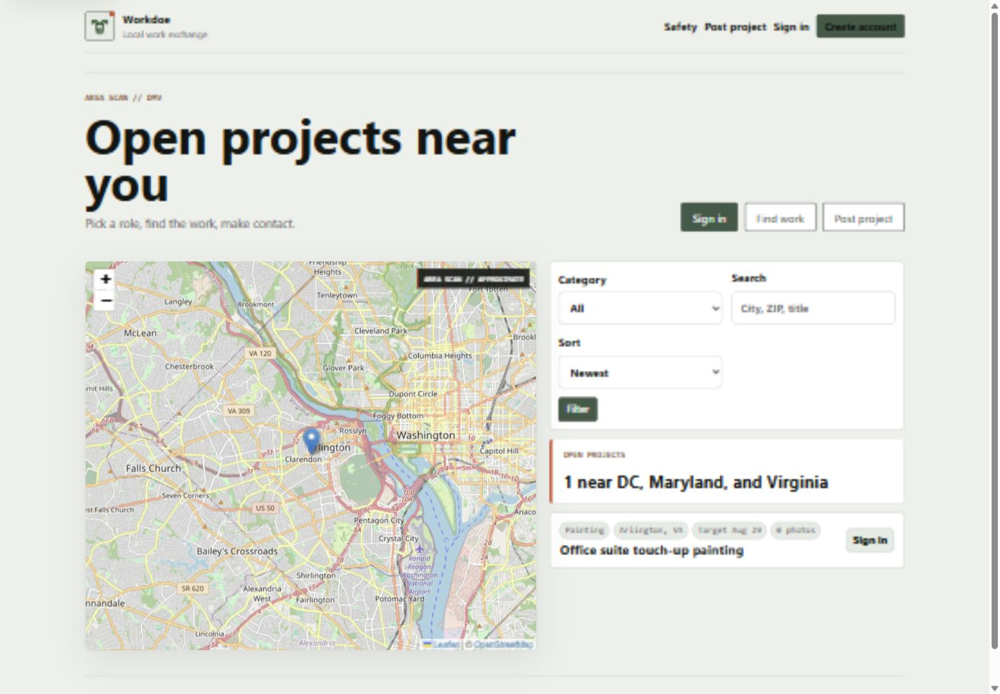

- Strength: open work, map, search, role entry, and project posting are visible
  without a marketing detour.
- Strength: the approximate-location label and OpenStreetMap attribution are
  visible.
- Review note: the local dataset contains one open project and does not label it
  as demonstration data. We must confirm whether this is intentional local seed
  data before accepting the public-demand representation.
- Accessibility limit: this screenshot does not prove keyboard, screen-reader,
  contrast, or zoom behavior.

### Step 2: Select a project and sign in

Status: `Pass locally; production email delivery not tested`.

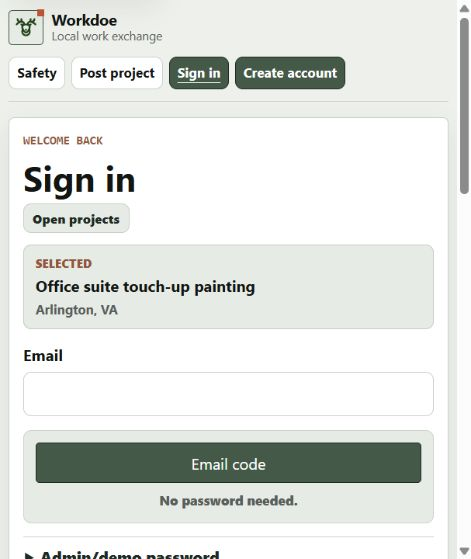

- The selected project survives the move from the public marketplace to sign
  in, and the email-code form stays on the Workdoe page.
- Empty submission leaves focus on the invalid required email field.
- The local-only admin/demo password control is intentionally excluded from
  the production Worker experience.

### Step 3: Choose a contractor account

Status: `Pass locally`.

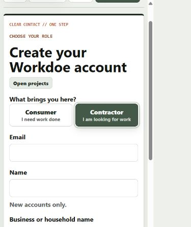

- Consumer is the default on an unqualified account-creation visit; selecting
  Contractor updates the checked role correctly.
- No horizontal page overflow was observed at the tested phone viewport.

### Step 4: Validate and save a project draft

Status: `Pass locally`.

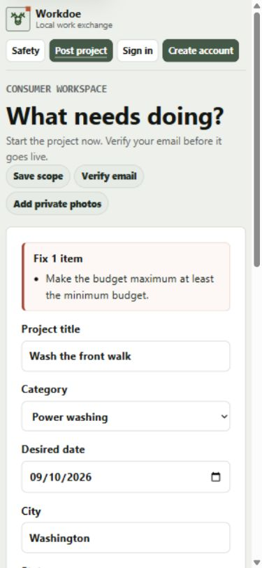

- A maximum below the minimum returns one concise alert, links the error to the
  field, preserves entered data, and blocks the handoff.
- Correcting the value saves the server-side draft and opens account creation
  with Consumer selected and a visible `Draft saved` state.

### Step 5: Review safety guidance

Status: `Conditional`.

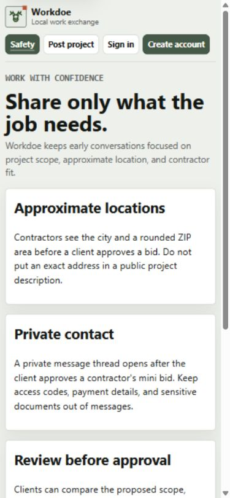

- Approximate locations, private contact, bid review, and moderation are
  explained in plain language.
- Gap: a visitor reading `Report concerns` receives no actionable reporting,
  support, or emergency route.

### Step 6: Preview a contractor

Status: `Conditional; disclaimer fixed locally`.

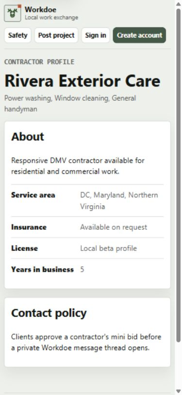

- The profile hides email/contact data and explains that messaging opens only
  after bid approval.
- The original screen could imply that insurance and licensing claims were
  verified. The local and Worker views now explicitly state that profile
  details are self-reported and not verified or guaranteed by Workdoe.

### Step 7: Open Privacy or Terms

Status: `Gap / launch blocker`.

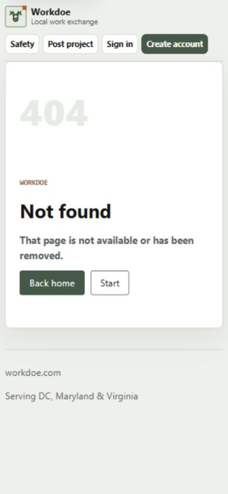

- `/privacy` and `/terms` both return HTTP 404.
- The generic not-found screen is usable, but it cannot substitute for approved
  public policies.

### Step 8: Post and manage a consumer project

Status: `Pass locally`.

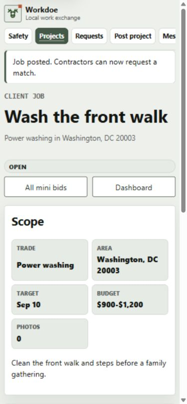

- The verified consumer receives the saved draft with title, category,
  location, date, budget, and description intact.
- Posting opens the owner detail page; editing, close/reopen, and one private
  image upload all persisted. The uploaded image rendered at its real intrinsic
  dimensions through the protected media route.

### Step 9: Keep authenticated navigation visible

Status: `Resolved locally`.

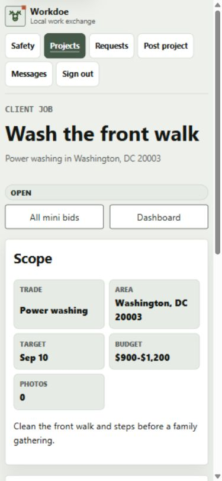

- Initial evidence showed `Messages` clipped behind a hidden horizontal
  scroller.
- The phone navigation now wraps into two rows. Browser geometry confirmed all
  six links are inside the viewport, document width remains 375 pixels, and
  each navigation target is 44 pixels high.

### Step 10: Approve and use a private message thread

Status: `Pass locally`.

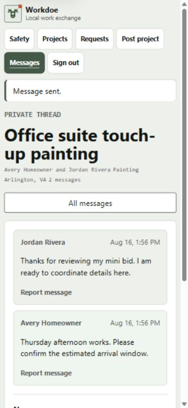

- The pending bid displayed contractor profile, scope, price, timeline,
  availability, experience, and questions before approval.
- Approval created the private thread. Consumer and contractor messages both
  persisted, and a message-level report was submitted for later admin review.

### Step 11: Find work and submit a mini bid

Status: `Pass locally`.

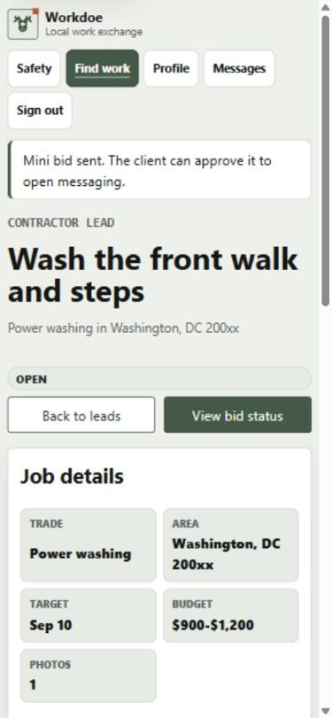

- Category filtering reduced the lead board and map to the matching project.
- The contractor saw `200xx`, not the client's exact ZIP, while the signed-in
  private job photo remained available.
- Scope, price range, timeline, availability, experience, and an optional
  question were saved; the dashboard then showed the bid as pending.

### Step 12: Moderate users, work, media, and messages

Status: `Pass locally`.

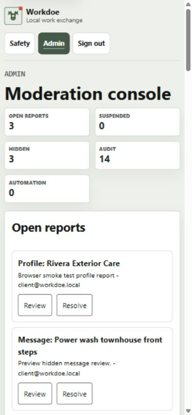

- Report resolution, user suspend/activate, job and photo hide/restore, and
  message hide/restore all persisted and produced audit records.
- Admin message inspection remained read-only apart from explicit moderation
  actions. No browser console errors or horizontal overflow were present.
- Scale limit: search, batching, and pagination are not yet needed for the
  controlled beta, but are required before a large moderation queue.

### Step 13: Reflow and interaction sizing

Status: `Conditional; automated checks pass and manual AT remains`.

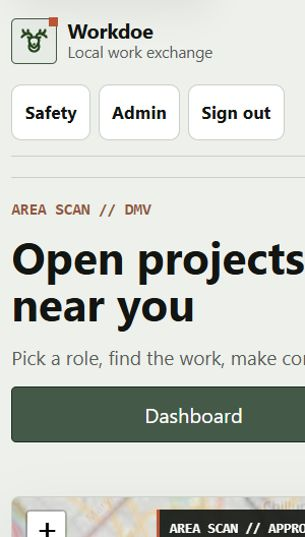

- At a 320-pixel viewport, the document had no horizontal overflow outside
  Leaflet's intentionally clipped tile canvas.
- Workdoe links, buttons, and form controls met the 44-pixel preferred target
  at the tested phone viewport. Computed text/background checks found no WCAG
  contrast failures on the public marketplace or admin console.
- The skip link is first in DOM order, displays a visible 44-pixel focus target,
  and points to a focusable main landmark. The browser harness could not prove
  Enter activation, and no screen-reader session was available; both remain
  manual release checks.
- Regression coverage now verifies the shared page-language, skip-link,
  navigation-landmark, focus-target, focus-style, reduced-motion, live-status,
  and Worker field-error wiring contracts.

## Verification ledger

| Check | Result |
| --- | --- |
| Full Python regression | 149 tests passed in 33.342 seconds |
| Cloudflare preflight | 106 checks passed; no warnings or errors |
| Worker packaging | Dry-run passed: 29 Python modules, 27 assets, 395.32 KiB total / 73.77 KiB gzip |
| D1 migrations | `0001`, `0002`, and `0003` applied to a fresh local D1 database |
| D1 recovery drill | Local export imported into isolated Wrangler state; 18 tables, representative row counts, and all three migration records matched; restricted temporary artifacts were removed after verification |
| Dependency security | `npm audit` and `pip-audit` found no known vulnerabilities |
| Static security | Bandit found 0 high and 0 medium findings; remaining lows are reviewed tool/local-development patterns |
| Source-secret scan | Matches were redaction test fixtures; no tracked credential value was identified |
| Live Cloudflare/GitHub read-only check | DNS delegation, apex, www, custom-domain policy, GitHub production environment/secrets, local preview, and ambient encrypted Wrangler OAuth are ready; 6 of 7 required Worker secret names are present, with only `CLERK_WEBHOOK_SECRET` missing |
| Non-interactive release credential | Current shell lacks `CLOUDFLARE_API_TOKEN`; GitHub production deploy secrets are already ready, so the missing local token blocks local automation but does not require another GitHub secret write |
| Cloudflare Email Service | Domain onboarding reports enabled for `workdoe.com`; configured sender is `no-reply@workdoe.com`; no message was sent during this review because real test recipients and consent are still required |
| Live data resources | D1 exists in WNAM with `0003` pending by design; R2 exists and is empty; both Workdoe queues exist with one configured producer and consumer each |
| Production smoke | DNS, HTTPS, health, jobs API, headers, social card, and Clerk proxy pass; production Clerk and Safety/Privacy/Terms checks fail; discovery files warn |
| Browser console | No errors observed after the full local walkthrough |

## Decision log

| Date | Decision | Consequence |
| --- | --- | --- |
| 2026-08-15 | Visitors may save a 24-hour project draft before verification; drafts exclude email and photos. | Draft resumes after verified consumer login. |
| 2026-08-15 | One account has one permanent consumer or contractor role during beta. | Conflicting later role intent is ignored and authorization remains role-bound. |
| 2026-08-15 | Project budget minimum and maximum are optional whole-dollar values. | Either bound may stand alone; maximum cannot be lower than minimum. |
| 2026-08-16 | First release is a controlled beta. | Clerk Restricted sign-up and invitation-ticket proof are release gates; public browsing remains available. |
| 2026-08-16 | Consumers do not fulfill projects. | Consumer accounts cannot access the lead board or submit mini bids; contractors cannot post consumer projects. |
| 2026-08-16 | Beta exclusions remain in force. | No payments, escrow, subscriptions, contracts, reviews, verification guarantee, or dispute adjudication is represented. |

## Questions queue

Questions are handled one at a time so each answer can be reflected in the
requirements, implementation, and tests before moving forward.

1. Is local seed data permitted to appear without a `Sample` label, or should
   every non-user-created project be marked demonstration data?
2. Should Workdoe source be MIT, Apache-2.0, or proprietary while retaining
   open-source dependency notices?
3. Who is the legal operator, and what minimum age, prohibited-work,
   contractor-status, contact, retention, and deletion rules apply?
4. What response times should apply to safety reports and support requests?
5. Should search engines index the public sample marketplace during the
   controlled beta, or should `robots.txt` block crawling until real jobs and
   approved public policies are live?
6. Can one project approve multiple contractors, or should the first approval
   close the project and reject its remaining pending mini bids?
7. Should high-confidence email addresses, phone numbers, and URLs be blocked
   in pre-match project and bid text, and how should likely street addresses be
   handled without creating harmful false positives?
