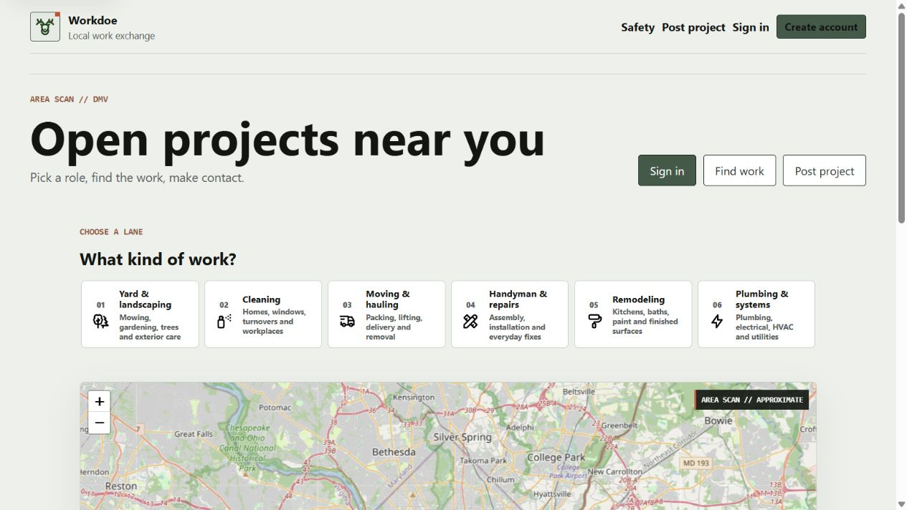
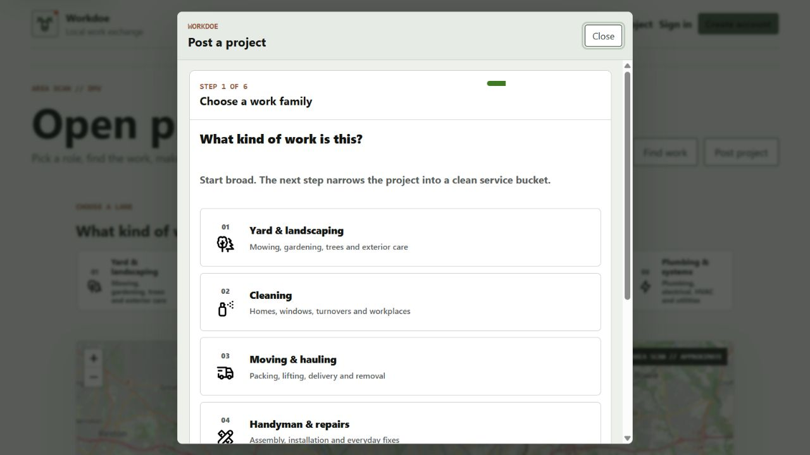
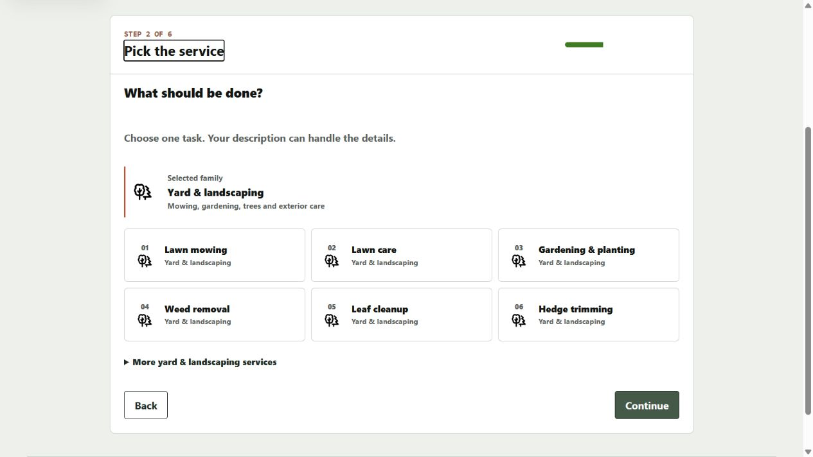
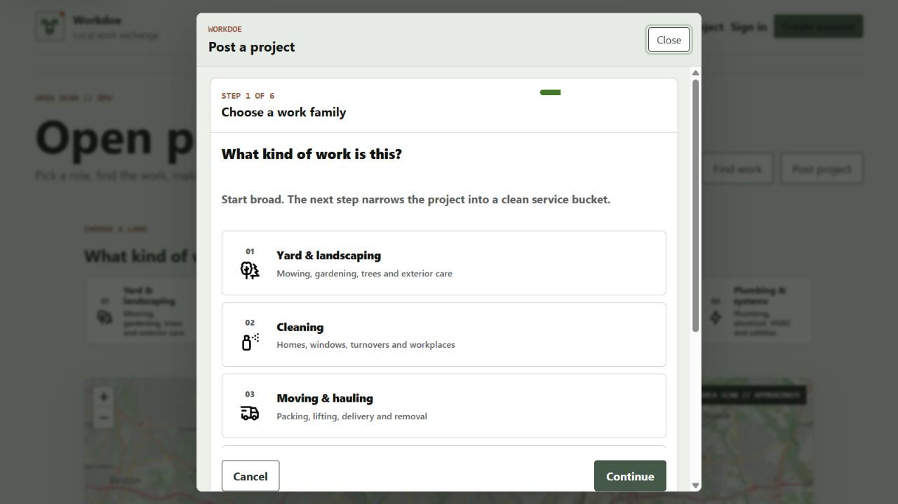
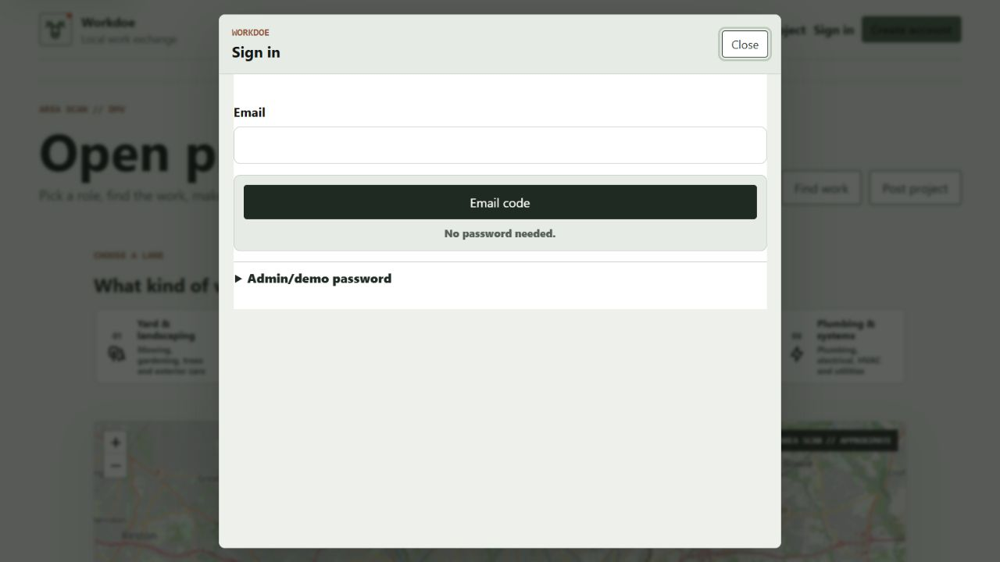
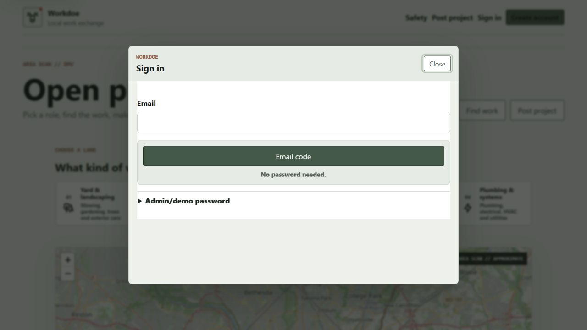
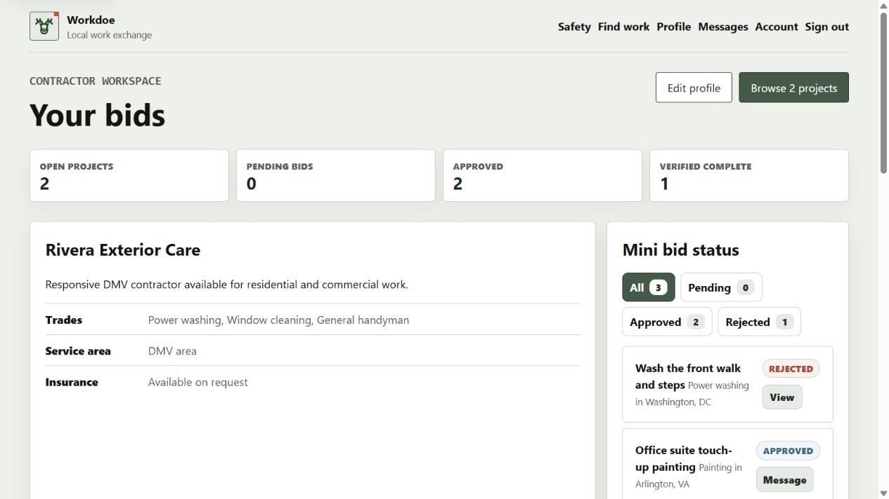
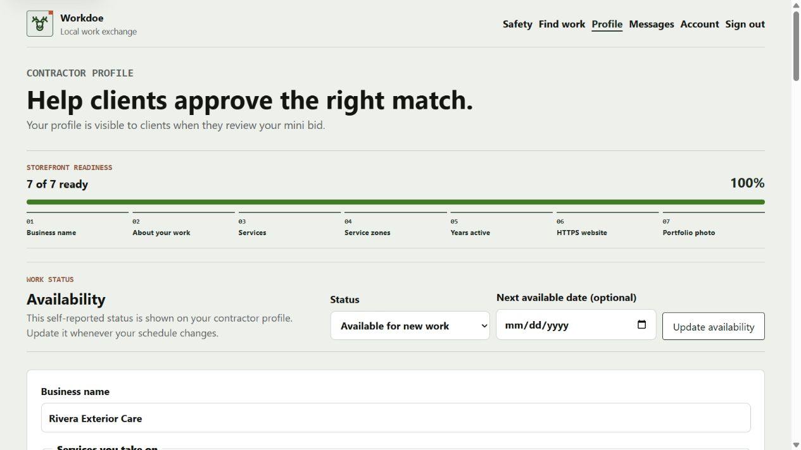
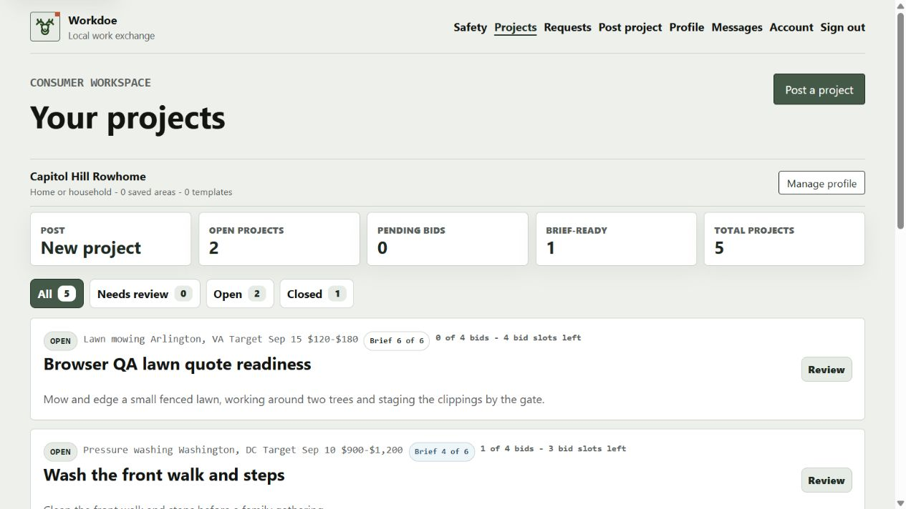

# Workdoe Commercial Journey Audit

Date: 2026-08-21

Scope: current local public entry, consumer project composer, same-page sign-in,
contractor dashboard/profile, and consumer dashboard/history.

User goal: let a consumer identify work, begin a project, and sign in without
losing the marketplace context; let a contractor understand available work and
maintain a credible business storefront.

## Journey Steps

1. **Public marketplace entry - healthy.** The open-project heading, three
   role actions, numbered six-family picker, approximate map, and two real
   project rows are all visible without signing in.

   

2. **Open project composer - fixed.** The composer opens in place and keeps
   the marketplace visible behind it. Before this pass, the inner form's
   overflow clipping defeated its sticky action row, leaving Cancel and
   Continue below the visible dialog.

   

3. **Choose a family and task - healthy.** Step 1 offers six numbered,
   icon-led families. Step 2 narrows the selection to six common tasks with a
   more-services disclosure and preserves explicit Back/Continue controls.

   

4. **Continue through the composer - fixed.** The form now uses clipping that
   does not create a scroll container, so the sticky action row remains in the
   iframe viewport. This keeps the explicit choice confirmation accessible
   without unexpected auto-advance.

   

5. **Same-page sign-in - healthy after fit adjustment.** Email code is the
   primary action, password entry is limited to a collapsed local admin/demo
   disclosure, and the user stays on the marketplace. The authentication
   dialog now uses a compact height instead of the full project-flow height.

   

   

6. **Contractor workspace and storefront - healthy.** The dashboard exposes
   open projects, bid states, verified completion history, and proposal
   templates. Profile setup includes business name, description, exact
   services, service zones, availability, HTTPS website, portfolio photos,
   and reviewable credential claims.

   

   

7. **Consumer workspace and history - healthy.** The dashboard exposes open
   projects, bid capacity, brief readiness, closed work, reusable templates,
   post-again, and invite-again paths without displaying exact addresses.

   

## Accessibility Evidence

- Confirmed in the captured DOM: skip link, labelled navigation, heading order,
  labelled map region, labelled radio choices, progress element, form labels,
  dialog name, keyboard-focused step heading, and visible focus treatment.
- The composer retains explicit confirmation buttons rather than advancing on
  radio selection, which avoids an unexpected context change for keyboard and
  assistive-technology users.
- Screenshot and DOM evidence do not prove full WCAG conformance, screen-reader
  announcements, high zoom behavior, or a complete keyboard-only journey.
- The in-app browser's temporary viewport override did not change the active
  tab dimensions during this run, so no new mobile screenshot was accepted.
  Existing responsive CSS and automated checks remain indirect evidence only.

## Remaining Launch Proof

- Run consumer and contractor journeys with real production Clerk email codes.
- Repeat this capture on physical phone and tablet viewports after deployment.
- Complete keyboard-only and screen-reader acceptance with representative users.
- Validate comprehension and completion time with DMV consumers and contractors.
