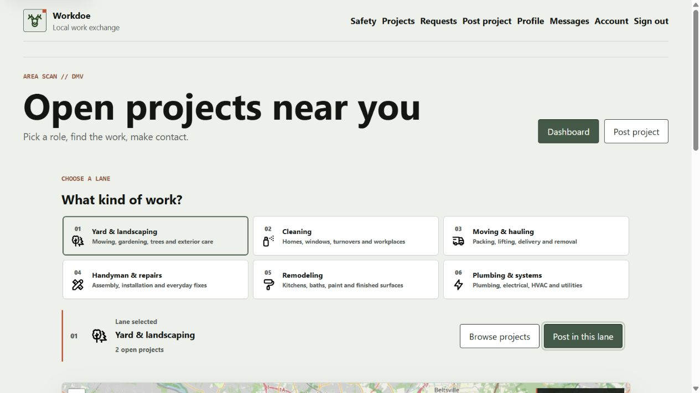
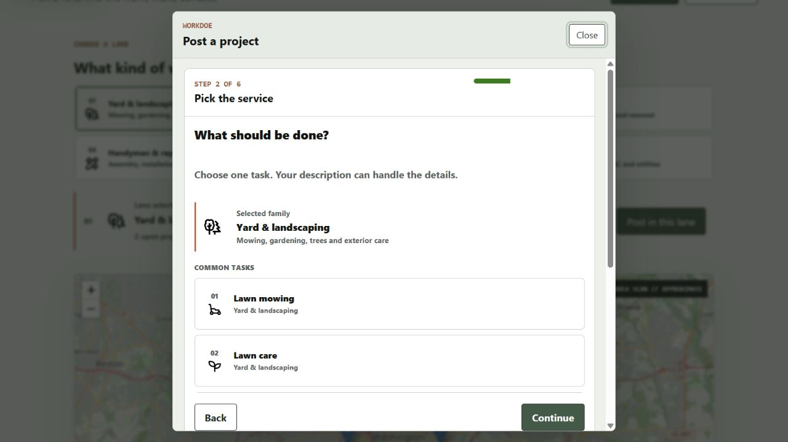
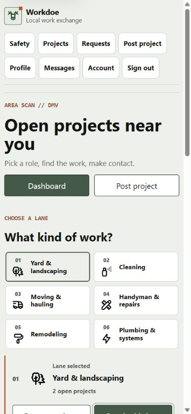
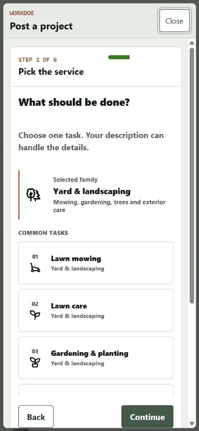
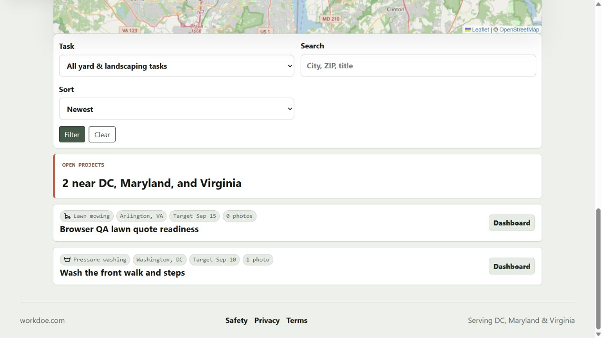

# Workdoe Gamified Marketplace Follow-up

Date: 2026-08-21

Scope: six-family public marketplace entry, landscaping task selection, mobile
adaptation, and task-specific project-row icon continuity.

## Accepted Journey Evidence

1. **Public desktop selector - healthy.** Six numbered work families appear
   before the map and open projects. Each uses a vendored Tabler icon and the
   selected lane remains visible in the URL and filter state.

   

2. **Detailed landscaping tasks - healthy.** Yard and landscaping expands into
   distinct common tasks, including mowing, planting, cleanup, tree work,
   pressure washing, and fencing, with a more-services disclosure for the full
   taxonomy.

   

3. **Public mobile selector - healthy.** At 390 by 844 CSS pixels, the six
   families form a stable two-column grid and retain usable labels, numbering,
   icon sizes, and selection targets.

   

4. **Mobile task selector - healthy.** Detailed task cards use task-specific
   icons and keep Back and Continue available in the dialog action row.

   

5. **Project-row icon continuity - healthy.** Public project rows retain the
   canonical task icon after selection. The inspected images loaded at their
   natural dimensions for lawn mowing and pressure washing.

   

## Rejected Or Reference-only Captures

- `01-consumer-dashboard.png`, `02-six-family-selector.png`, and
  `03-yard-task-selector.png` came from an older local process and are retained
  only as comparison evidence.
- `05-public-family-map.png` was rejected because it captured an unintended
  scrolled crop. The accepted desktop replacement is listed above.

## Follow-up Change

Task-specific service icons now continue into public, sign-in, start, and
contractor lead rows in both Flask and the Cloudflare Worker shell. Automated
tests assert the icon chip and canonical task icon path so this context is not
lost after selection.

## Remaining Human Evidence

- Test category comprehension with DMV consumers using their own project
  descriptions, including ambiguous jobs that cross two families.
- Test contractor scanning speed and whether exact-task icons improve correct
  lead selection without increasing indiscriminate bids.
- Repeat the complete journey on physical iOS and Android devices after the
  current source is deployed.
