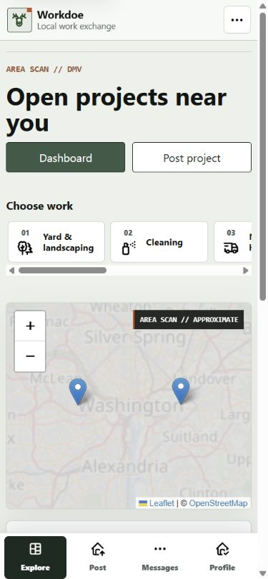
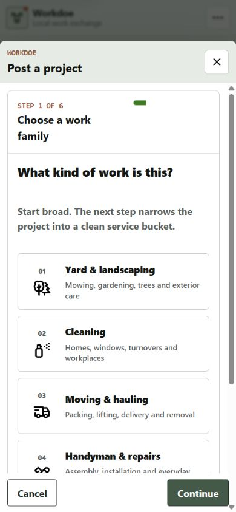
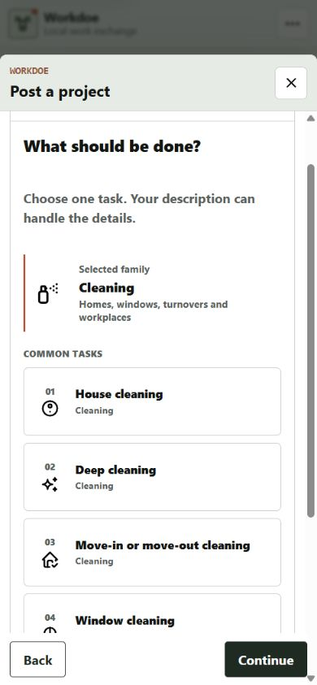
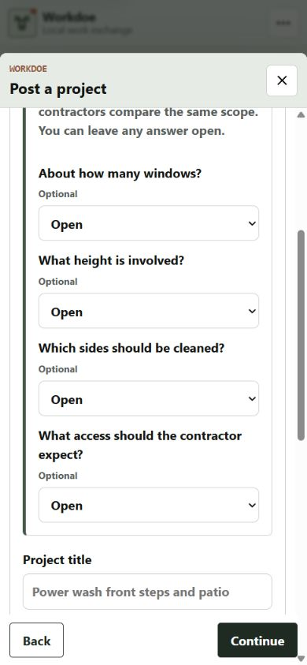
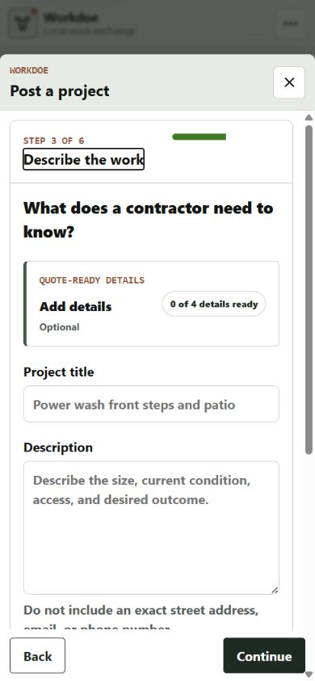
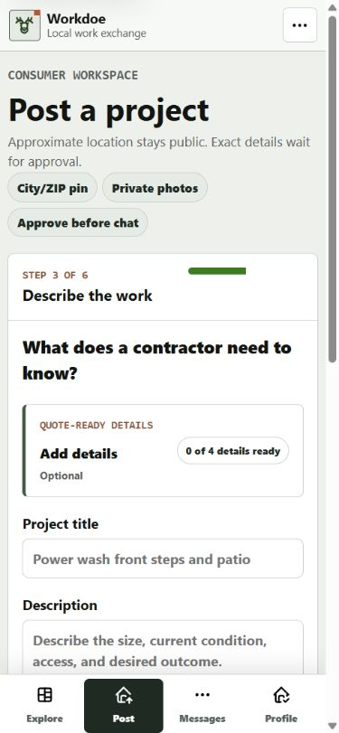
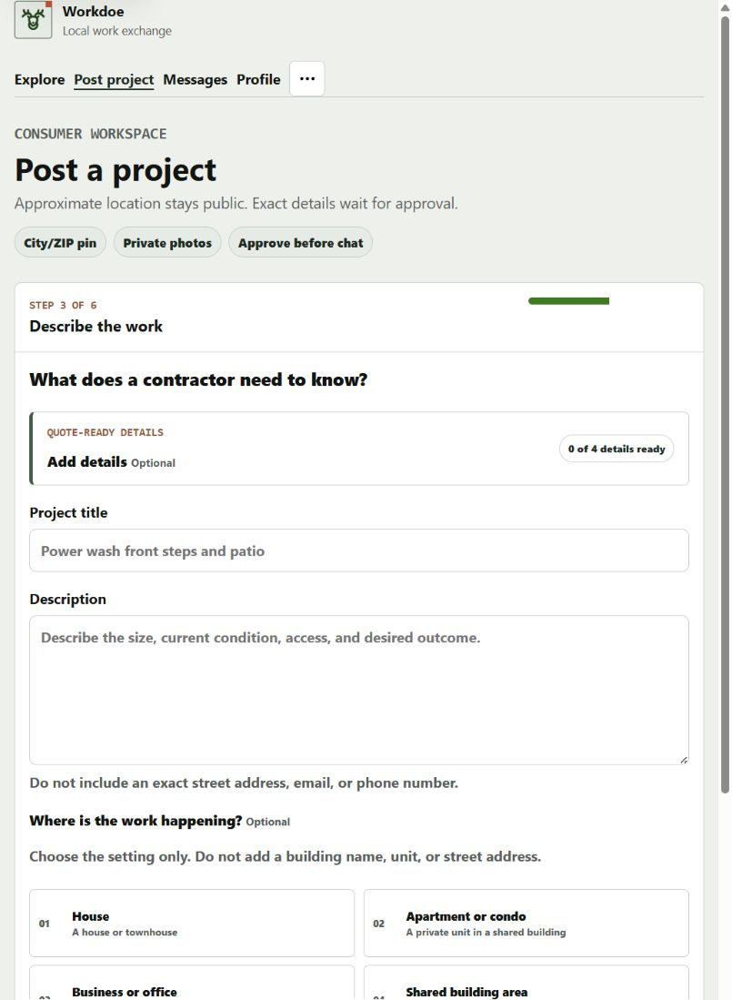
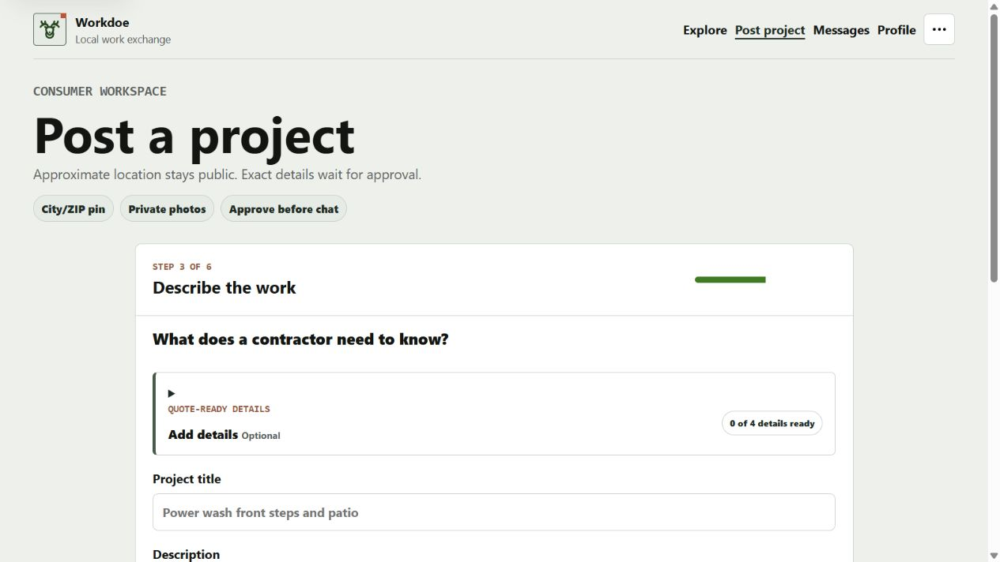

# Project Composer Friction Audit

Date: 2026-08-23

Surface: authenticated consumer project composer in the current local Flask
release candidate, using the route-backed native dialog at 390x844 and direct
fallback routes at 820x1180 and 1280x720.

## Verdict

The six-step structure remains useful, but the transition from service choice
to project details preserved the prior scroll position. On mobile, Step 3
therefore opened with its title 315 pixels above the dialog viewport. Four
optional quote questions then occupied 719 pixels before the required project
title. The corrected flow resets every forward/back transition to the step
heading and presents those optional questions as a compact native disclosure.

## Steps

1. **Explore entry - healthy.** The live approximate map remains in the first
   mobile viewport and Post is available as both a page action and primary task.

   

2. **Family and service choice - healthy.** The existing numbered, icon-led
   family and task choices retain one primary Continue action and the fixed
   dialog action row.

   

   

3. **Project details before correction - needs adjustment.** The dialog had a
   `scrollTop` of 362 pixels after advancing. The step title was outside the
   viewport, while the optional scope panel consumed 719 pixels and placed the
   required title at 591 pixels relative to the dialog viewport.

   

4. **Project details after correction - healthy.** The dialog now opens at
   `scrollTop: 0`; the step title begins 48 pixels from the dialog content top.
   The closed optional section is 106 pixels high, and the required title begins
   at 341 pixels. Opening the disclosure exposes the first select normally.

   

5. **Responsive fallback routes - healthy.** Direct URLs preserve the same
   compact disclosure at 390x844, 820x1180, and 1280x720 with zero document
   horizontal overflow.

   

   

   

## Accessibility Notes

- Forward and Back transitions keep keyboard focus on the new step heading and
  now expose that heading visually instead of focusing it above the viewport.
- Quote details use native `details` and `summary` behavior, retain a visible
  focus treatment, and stay open when prior answers exist.
- All scope selects remain in the document and retain their labels; only the
  selected service's inputs are enabled.
- This pass does not claim screen-reader output, forced-colors behavior, 200%
  zoom, or production assistive-technology acceptance.

## Implementation Notes

The change reuses the existing composer script, CSS tokens, Jinja macro, and
Cloudflare Worker HTML adapter. It does not change the six-step data contract,
service taxonomy, validation, stored scope answers, or posting permissions, and
it adds no runtime dependency.
