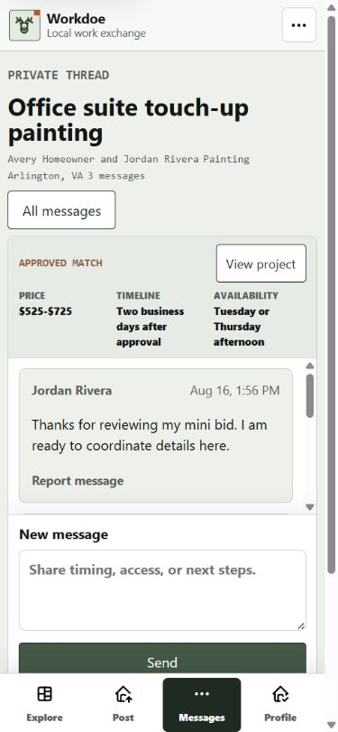
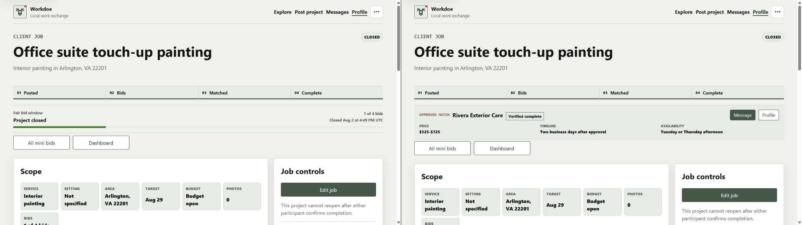
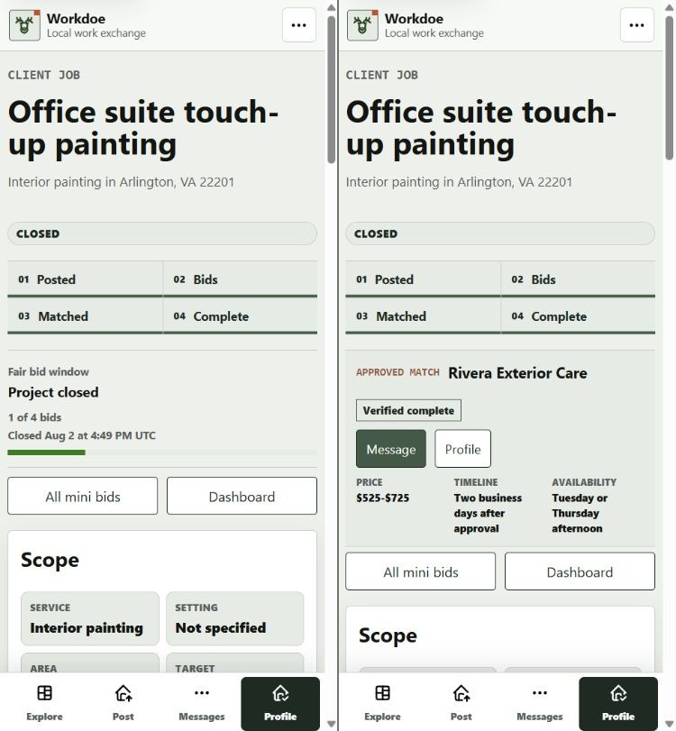
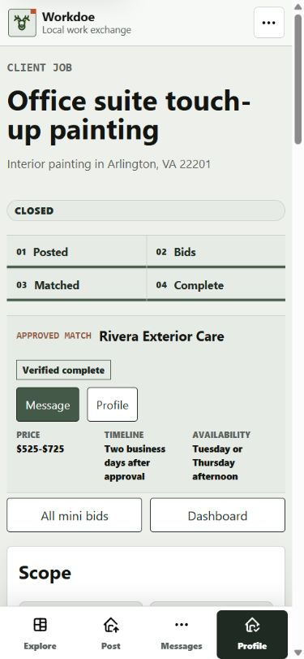
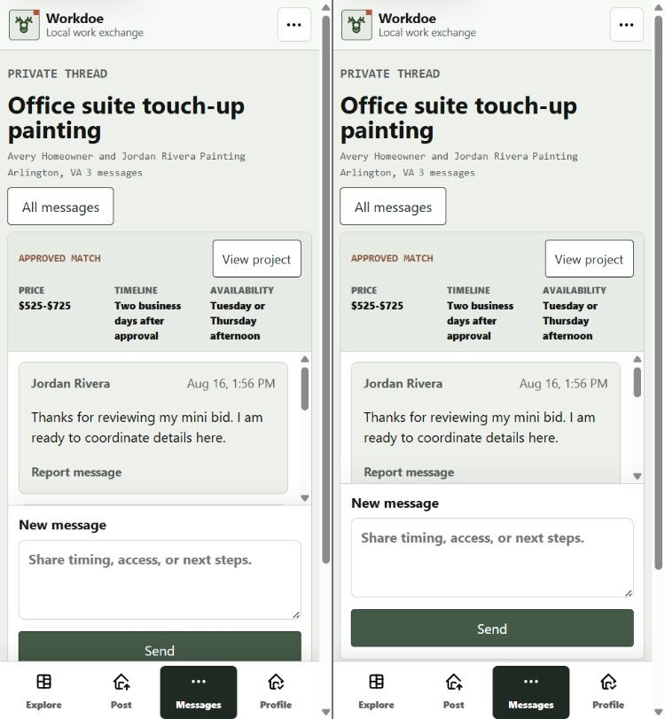

# Project Lifecycle Audit

Date: 2026-08-23

Surface: authenticated consumer project detail and approved-match message
thread in the local Flask release candidate.

## Verdict

The completed-project state now leads with the contractor the consumer chose,
the agreed mini-bid terms, and the two useful next actions. The closed bid
window no longer competes with that information. The mobile message composer
also clears the fixed task navigation instead of being partially covered.

## Steps

1. **Approved-match message thread before correction - needs adjustment.**
   The approved price, timeline, and availability were easy to find, and the
   conversation remained independently scrollable. At 390x844, however, the
   fixed task navigation covered the lower edge of the Send button.

   

2. **Completed project before correction - needs adjustment.** The project
   journey correctly showed completion, but the next band repeated a closed
   bid window. The approved contractor and agreed terms appeared only farther
   down the page, weakening the project-history use case on both mobile and
   desktop.

   

   

3. **Completed project after correction - healthy.** The approved contractor,
   verified-complete status, Message and Profile actions, price, timeline, and
   availability now follow the journey immediately. The existing restrained
   green/gray visual language and task navigation remain intact, with no
   horizontal document overflow at the checked mobile width.

   

4. **Approved-match message thread after correction - healthy.** The 390x844
   layout keeps match context, one readable message, the complete composer,
   and the fixed task navigation in one viewport. The Send button has 16
   pixels of measured clearance above the navigation.

   

## Accessibility Notes

- The approved-match summary is exposed as a named region, agreed terms use a
  description list, and Message/Profile remain ordinary links.
- The message form retains its accessible name and visible label. The fixed
  navigation does not cover its primary action at the checked mobile size.
- Screenshot review cannot establish screen-reader output, zoom behavior,
  forced-colors behavior, contrast ratios, or reduced-motion behavior. Those
  remain release-gate checks rather than claims from this audit.

## Data And Behavior Notes

- The approved-match summary is independent of the selected mini-bid filter,
  so `?bids=pending` cannot hide a completed match or incorrectly expose a
  Reopen action.
- The summary projection contains contractor name, public profile route,
  private thread route, completion state, price, timeline, and availability.
  It does not select or render email, phone, or exact-address fields.
- Open projects retain the bid-window presentation; only non-actionable closed
  and hidden states omit it.

