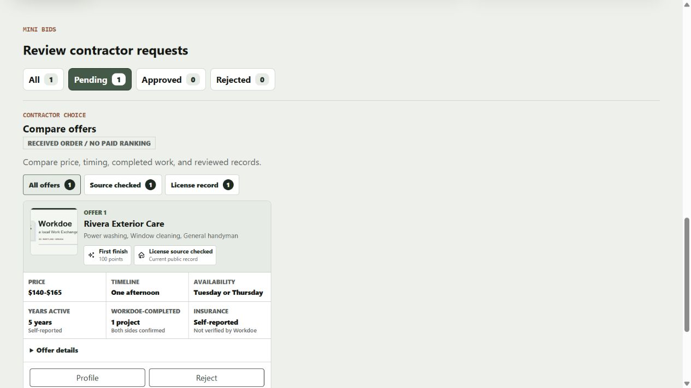
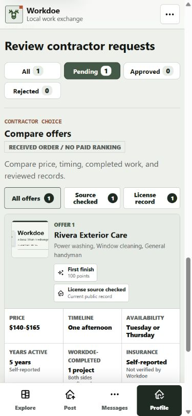
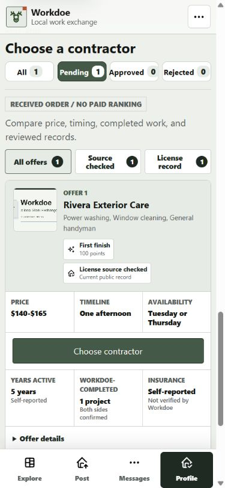
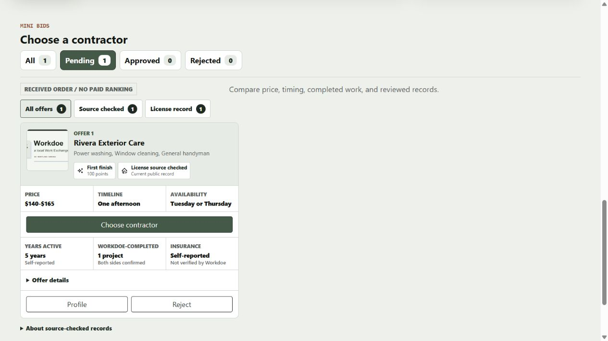
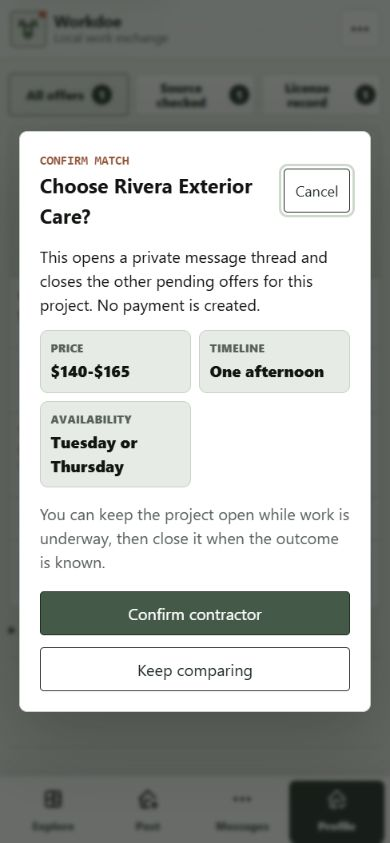

# Consumer Contractor Choice Follow-Through

Date: 2026-08-24

Surface: the current local consumer journey from a pending bid on the dashboard
to contractor comparison and the match-confirmation dialog. Evidence was
captured at 390x844 and 1280x720 from the Flask reference adapter. The
Cloudflare Worker uses the matching server-rendered structure and action order.

## Verdict

The comparison already presented the right factual signals, but its hierarchy
delayed the decision. Two headings, a wrapped status row, and secondary actions
appeared before the hiring action. The corrected view keeps license meaning and
received order intact while making the consumer's primary choice visible in the
first mobile viewport.

## Steps And Findings

1. **Desktop comparison before - needs correction.** The repeated “Review
   contractor requests” and “Compare offers” hierarchy consumes space while the
   primary Choose action falls below the visible Profile and Reject controls.

   

2. **Mobile comparison before - needs correction.** Rejected wraps onto a
   second row, the duplicated headings delay the card, and the 844-pixel screen
   ends before any hiring action appears.

   

3. **Mobile comparison after - healthy.** One “Choose a contractor” heading
   leads the task, all four statuses stay in one row, and Choose begins at 575
   pixels after price, timeline, availability, milestone points, and the current
   source-checked-license signal. Supporting self-reported facts remain below.

   

4. **Desktop comparison after - healthy.** The same compact ordering keeps the
   card scannable and the primary action visible without stretching a single
   offer across unused desktop space.

   

5. **Confirmation - healthy.** The route-backed native dialog repeats the
   selected contractor and terms, states that a private thread opens and no
   payment is created, and keeps Confirm contractor distinct from Keep
   comparing. Closing restores focus to the same Choose button.

   

## Accessibility And Safety

- The section has one visible level-two heading and a named comparison region.
- Status and credential filters remain ordinary links with current-page state;
  direct URLs and no-JavaScript behavior are unchanged.
- The action order is price, timeline, availability, Choose, supporting facts,
  offer details, Profile, then Reject. The visible button retains a contractor-
  and project-specific accessible name.
- Source-checked license wording remains atomic and separate from self-reported
  insurance and experience. No “verified contractor” or legal-eligibility claim
  was introduced.
- Both tested viewports had zero horizontal document overflow.

## Data And Provenance

This pass changes existing HTML/CSS presentation only. It adds no dependency,
script, endpoint, database field, stored score, ranking input, personal data,
media exposure, or third-party recipient. Public competitor documentation was
used only to validate general comparison principles; no competitor code, copy,
assets, or protected visual composition was copied.

## Limits

The browser run verifies visible layout, native dialog behavior, and focus
restoration in the local reference adapter. It does not prove production Clerk
delivery, a real two-account approval, screen-reader announcements, 200 percent
zoom, forced-colors behavior, or the not-yet-deployed Worker release.
