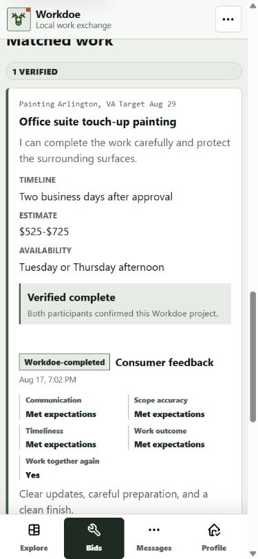
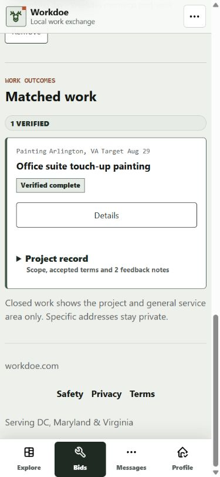
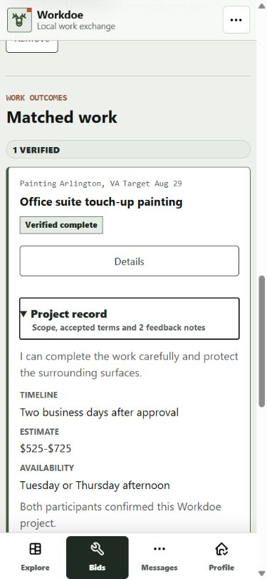
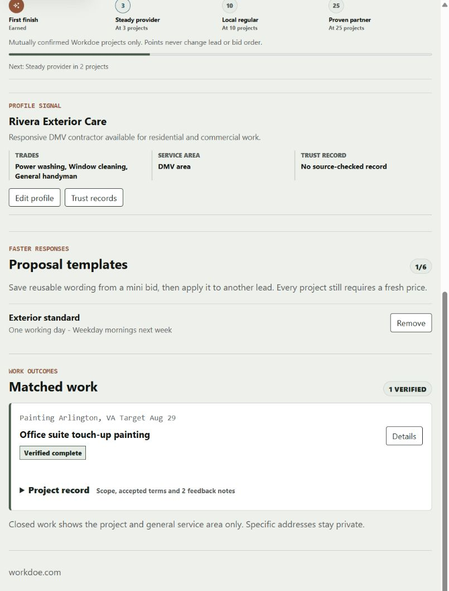
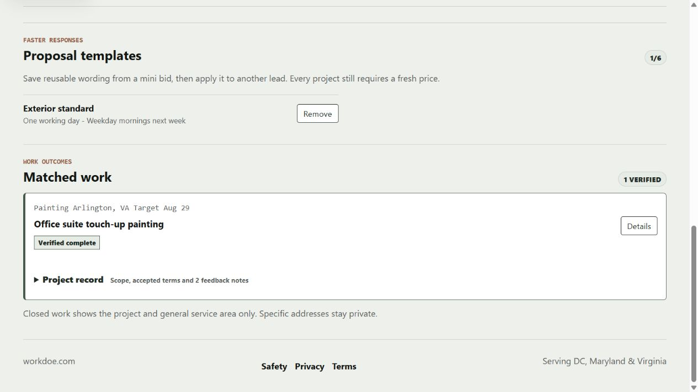

# Contractor Work-History Audit

Date: 2026-08-24

Surface: authenticated contractor dashboard at `/contractor/dashboard#completed-work`.

Task: scan completed Workdoe projects, see completion state, and open the full
project record only when needed.

## Captured Journey

1. Open the contractor dashboard and move to Matched work.
2. Scan the general service area, project name, completion state, and Details
   action without opening the archive.
3. Open Project record to inspect scope, accepted terms, and completed-work
   feedback.
4. Close the disclosure and continue through the dashboard.

## Before

The complete project archive consumed the rest of the phone viewport and made
the dashboard 3,441 pixels tall in the captured seeded state. The content was
valid, but a contractor could not scan the history lane before reading every
feedback record.

## After

## Findings Resolved

1. **History was not scannable.** Each completed item now keeps the project,
   general area, completion state, and role-correct Details action visible.
2. **Supporting evidence dominated the dashboard.** Scope, accepted terms, and
   feedback now live in a closed native `details` element. The captured phone
   document is 2,531 pixels tall, 910 pixels shorter than the aligned baseline.
3. **Repeated controls needed distinct names.** Each summary uses the project
   name in its accessible label while retaining concise visible text.
4. **Touch and keyboard behavior needed to remain native.** The summary is a
   44-pixel target with the browser disclosure marker, browser-managed keyboard
   semantics, and no script dependency.
5. **Privacy boundaries needed to survive the redesign.** Only city/state is
   visible; the implementation and regression tests continue to reject the
   project's ZIP code from the contractor dashboard.

## Responsive And Accessibility Checks

- `390x844`, `820x1180`, and `1280x720` had no horizontal overflow.
- The collapsed record is the default in a fresh response.
- The native summary retains focus after pointer activation and exposes the
  project name to assistive technology. Automated markup checks preserve the
  native disclosure contract; a production screen-reader pass remains a gate.
- Expanded state keeps all accepted terms, both completed-work feedback cards,
  reporting controls, and the fixed mobile task navigation.
- Reduced-motion behavior is unchanged because this batch adds no animation.

## Evidence Limits

- The local seeded account proves rendered behavior and route permissions, not
  production Clerk delivery or production data volume.
- The in-app browser's full-page stitch duplicated fixed regions in one rejected
  capture. The accepted evidence uses aligned viewport captures at the Matched
  work anchor.
- Production screen-reader and Core Web Vitals evidence remain launch gates.
