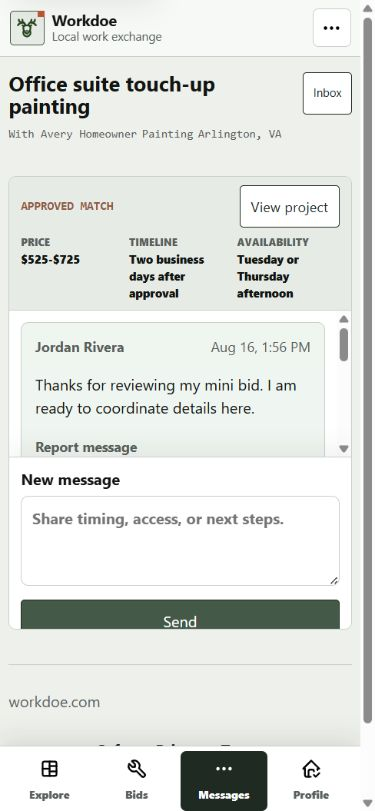
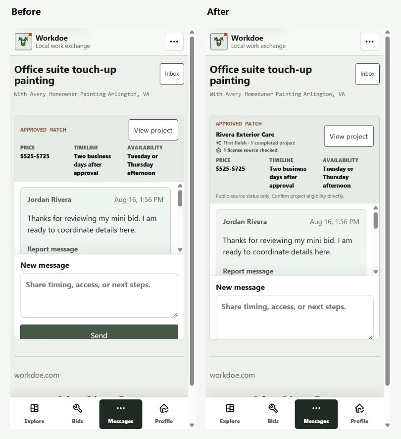
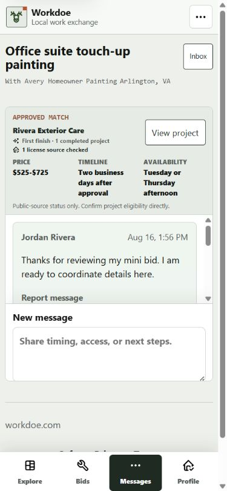

# Approved-Match Provider Continuity Audit

Date: 2026-08-24

Surface: authenticated private message thread at `/messages/2`.

Task: continue coordinating an approved project while retaining the factual
provider context that supported the consumer's choice.

## Captured Journey

1. Approve a contractor from the consumer's received-offer comparison.
2. Open the resulting private message thread at 390x844.
3. Confirm the approved terms, chosen provider, Workdoe completion milestone,
   and current source-checked record state remain together.
4. Confirm neither the claimed credential identifier nor its source URL is
   present in the rendered thread.
5. Continue into the bounded message list and reply composer without leaving
   the conversation.

## Before

The message thread retained accepted price, timeline, and availability, but it
did not identify the selected provider or carry forward the factual completion
and source-check signals shown during contractor comparison.

## After

The accepted layout places provider identity and two compact factual signals in
the approved-match heading. Price, timeline, and availability retain their
existing three-column layout instead of becoming an unreadable four-column
grid.

## Findings Resolved

1. **Provider context disappeared after approval.** The chosen provider's
   public name now links to the ownership-checked public profile from both the
   Flask and Cloudflare Worker thread contracts.
2. **Decision evidence was fragmented across screens.** Mutually confirmed
   Workdoe completion history and the current aggregate source-checked record
   state now remain visible during coordination.
3. **A first compact layout made provider facts too narrow.** The rejected
   four-column variant is retained as `03-mobile-no-record-after.png`; the
   revised heading treatment reduces the approved-match block to 186 pixels at
   390x844 and keeps the existing accepted-term columns readable.
4. **Credential detail needed a strict privacy boundary.** The shared provider
   projection returns only provider ID, public name, ownership-aware profile
   URL, and aggregate reputation state. It does not select or render claimed
   identifiers, source URLs, email, phone, contact details, or addresses.
5. **A checked record could be mistaken for eligibility.** The thread states
   that the signal is public-source status only and asks participants to
   confirm project eligibility directly.

## Responsive And Accessibility Checks

- The accepted 390x844 state has no horizontal document overflow.
- Provider signals use text labels rather than color or icons alone.
- The provider name is a semantic link with an ownership-aware project
  context; accepted terms remain a semantic description list.
- Decorative vendored Tabler icons are hidden from assistive technology.
- The bounded message list, report disclosure, labeled reply field, and native
  Send control are unchanged.
- The change adds no script, animation, dependency, public ranking field, or
  stored personal data.

## Verification

- All 235 tests passed in 81.819 seconds, including focused Flask and Worker
  provider/message parity and privacy coverage.
- Full Ruff and the complete security/provenance gate passed across 658
  non-ignored files with no known Python or Node vulnerabilities, no
  medium/high Bandit findings, no unreviewed secret, and no dependency drift.
- Cloudflare preflight returned no warnings. The D1 verifier loaded all 34
  migrations, used all three expected public map/photo indexes, and found no
  table scan.
- Wrangler 4.125.0 packaged 48 Python modules and 87 static assets at 938.51
  KiB / 172.35 KiB gzip using `--dry-run`; no deployment occurred.

## Evidence Limits

- The browser capture uses local seeded records and proves rendered state, not
  production Clerk delivery, live D1 data, or public traffic performance.
- Aggregate source-check state is factual platform context, not Workdoe
  verification of a contractor's legal eligibility for a specific project.
- Browser evidence does not replace a production screen-reader pass, Core Web
  Vitals measurements, or owner/legal approval of the advisory-only model.
