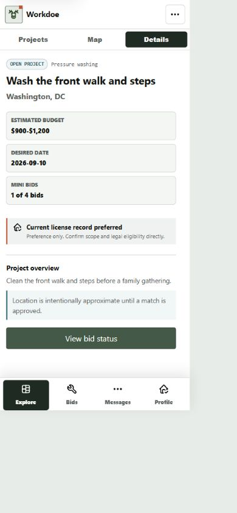
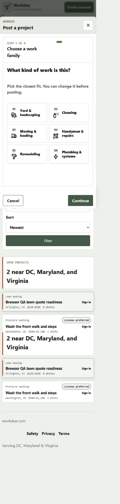
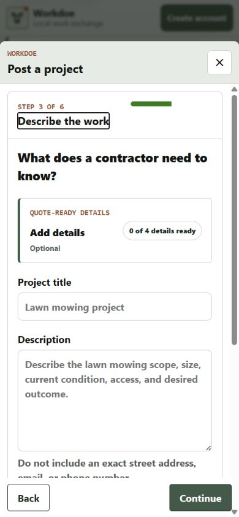
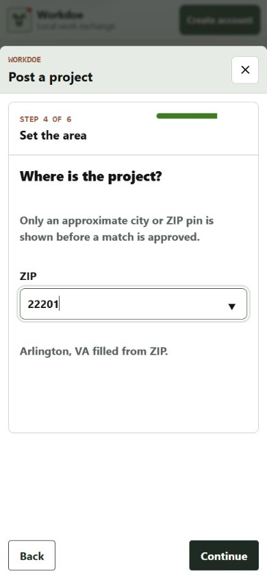

# Project Posting Workflow Pass

Date: 2026-08-24

Surface: current local Workdoe candidate at 390x844, covering the public
same-page project composer and the already accepted contractor selected-project
workspace.

## Verdict

The six-step structure remains useful, but Step 3 and Step 4 asked consumers to
repeat information Workdoe already knew. The selected canonical task now
supplies an editable project-name suggestion. A recognized pilot ZIP now fills
city/state and collapses those two fields, reducing routine location entry to
one visible control. Unknown ZIPs immediately restore the original city/state
fallback.

## Evidence

1. **Contractor opportunity baseline - healthy.** The selected-project view
   retains approximate location, budget, date, bid capacity, license preference,
   and one status-aware action without exposing the project address.

   

2. **Family choice - healthy.** The public Post action keeps the map in place
   and opens the route-backed composer with six compact task families.

   

3. **Details before - avoidable input.** After choosing Lawn mowing, the prior
   state presented a blank required project-title field even though the task was
   already canonical.

   

4. **Details after - one less required decision.** The composer fills `Lawn
   mowing project`, labels it as suggested, and leaves it editable. Description,
   optional quote-ready details, and optional setting retain their existing
   behavior.

   

5. **Location after - one visible field for known ZIPs.** Entering `22201`
   fills Arlington, VA, keeps both values enabled for form submission, announces
   the result through a polite live region, and hides the redundant controls.

   

## Accessibility And Fallbacks

- The title remains a normal labeled input and can be edited before posting.
- ZIP assistance uses the existing datalist and an `aria-live="polite"` status;
  it does not request browser geolocation.
- City/state inputs remain required and enabled. CSS hides them only after the
  enhanced composer has matched a curated ZIP.
- An unknown ZIP removes the matched state, restores both controls, and removes
  only the city/state values supplied by the helper. The direct/no-JavaScript
  form continues to show all three location fields.
- This pass does not claim production screen-reader, 200% zoom, forced-colors,
  or assistive-technology acceptance.

## Data And Provenance

The change reuses the pinned project-composer script, existing Jinja and Worker
renderers, existing CSS tokens, and the repository's curated `DMV_ZIPS` table.
It adds no dependency, API, cookie, database column, location permission,
ranking signal, or user-data recipient.
