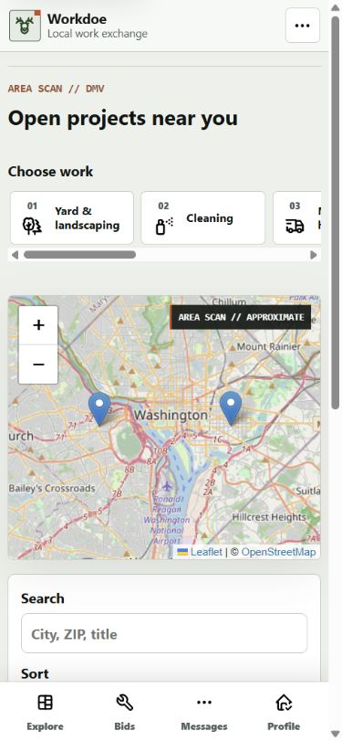
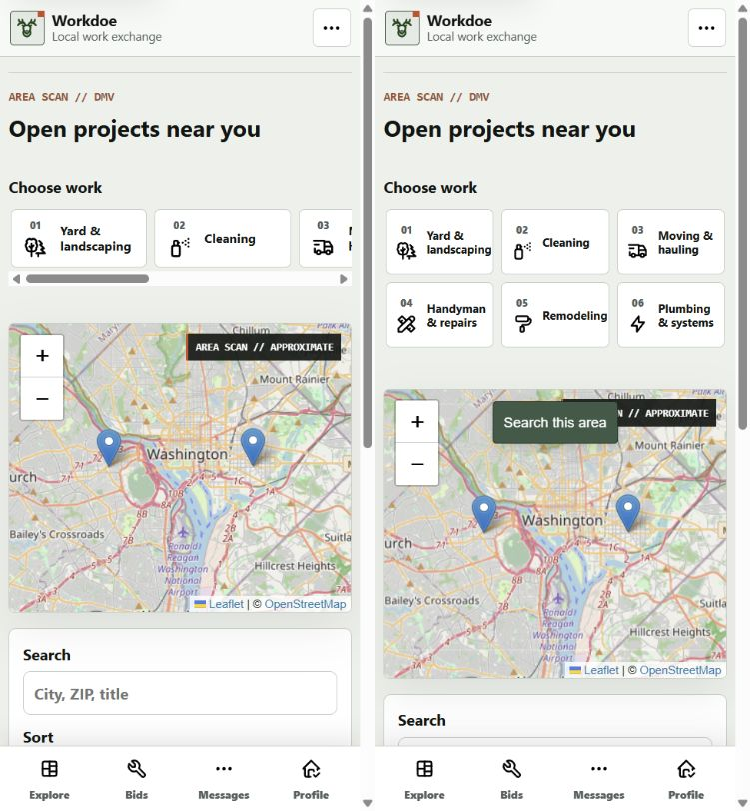
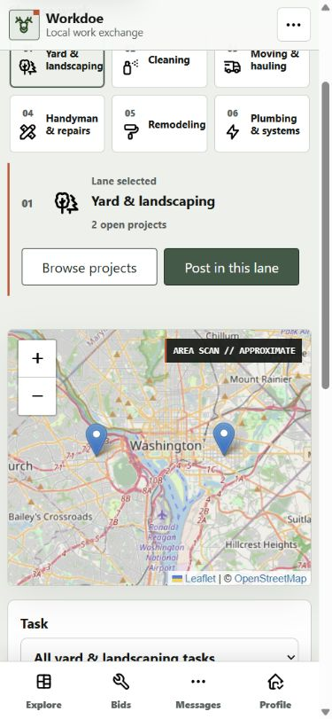
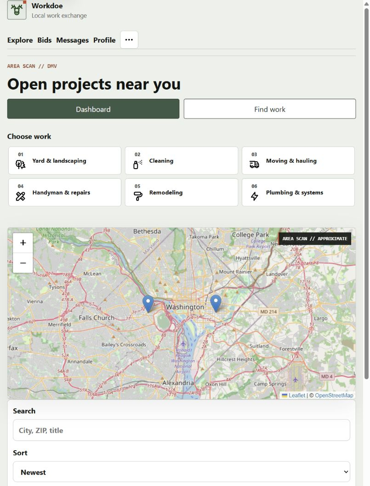
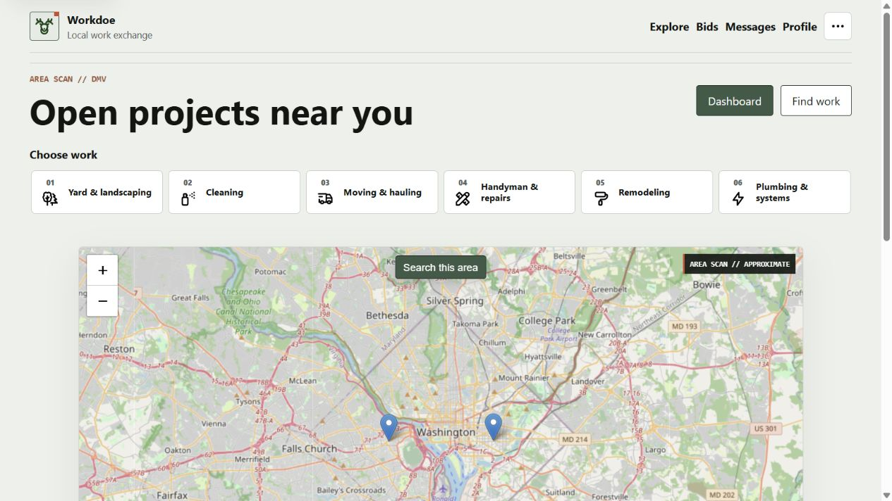

# Public Work-Family Selector Audit

Date: 2026-08-24

Surface: authenticated public project map at `/`.

Task: scan all six numbered work families, choose one, and continue into its
live map and task filter without leaving the marketplace surface.

## Captured Journey

1. Open the public project map at 390x844.
2. Scan the numbered work-family selector before moving into the map.
3. Choose `01 Yard & landscaping` and retain the selected project/map state.
4. Confirm the same selector and map composition at 820x1180 and 1280x720.

## Before

The phone layout presented the six families as a horizontal strip. Only lanes
`01`, `02`, and part of `03` were visible without a sideways gesture, and the
browser scrollbar competed with the map-first interaction.

## After

## Findings Resolved

1. **Half the work lanes were hidden on entry.** All six numbered families now
   fit in a three-column, two-row phone grid without horizontal scrolling.
2. **The selector depended on a subtle sideways-scroll cue.** The complete set
   is visible without a gesture, while every item remains a real URL-backed
   link with the existing icon and focus treatment.
3. **The map could not be displaced from the first viewport.** The phone map
   begins at 406 pixels and retains a stable 300-pixel height; the search panel
   remains visible below it.
4. **Touch labels needed to stay usable after compaction.** Each phone family
   control measured approximately 112 by 68 pixels at the accepted 390-pixel
   viewport. Labels wrap inside their cards without clipping or overlap.
5. **Selection needed to preserve marketplace context.** Choosing Yard &
   landscaping retained the selected project, added the canonical family to
   the URL, exposed the task filter, and offered `Post in this lane`.

## Responsive And Accessibility Checks

- The 390x844 layout exposed six visible families, no horizontal document
  overflow, and a 300-pixel map inside the first viewport.
- The 820x1180 and 1280x720 layouts exposed the same six links without
  horizontal document overflow; their existing three-column and six-column
  arrangements were unchanged.
- The selector remains semantic navigation. Number and icon decoration are
  hidden from assistive technology, the family name is the link name, and the
  selected link retains `aria-current="page"`.
- The change adds no script, animation, dependency, route, stored field, or
  public data. Reduced-motion behavior and no-JavaScript navigation are
  unchanged.

## Verification

- All 235 tests passed in 82.133 seconds.
- The complete security and provenance gate passed across 651 non-ignored
  files with no known Python or Node vulnerabilities, no medium/high Bandit or
  Ruff findings, no unreviewed secret, and no dependency drift.
- Cloudflare preflight returned no warnings. The D1 verifier loaded all 34
  migrations, used all three expected public map/photo indexes, and found no
  table scan.
- Wrangler 4.125.0 packaged 48 Python modules and 87 static assets at 933.56
  KiB / 171.53 KiB gzip using `--dry-run`; no deployment occurred.

## Evidence Limits

- The local seeded contractor session proves rendered and responsive behavior,
  not production Clerk email delivery, public traffic performance, or live D1
  data volume.
- Browser evidence does not prove screen-reader output, zoom/reflow at every
  intermediate width, or production Core Web Vitals. Those remain release
  gates.
